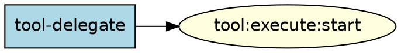

# DOT/Graphviz Artifacts Catalog

Comprehensive catalog of all DOT concepts, patterns, conventions, validation rules, and quality
standards across the Amplifier ecosystem. Synthesized from 13+ source files spanning two workspaces.

---

## Table of Contents

1. [Two Dialects of DOT in the Amplifier Ecosystem](#1-two-dialects-of-dot-in-the-amplifier-ecosystem)
2. [Dialect A: Attractor Pipeline DOT](#2-dialect-a-attractor-pipeline-dot)
3. [Dialect B: Architecture Documentation DOT](#3-dialect-b-architecture-documentation-dot)
4. [Dialect C: Resolve Pipeline DOT (node_type variant)](#4-dialect-c-resolve-pipeline-dot-node_type-variant)
5. [DOT Generation Tooling](#5-dot-generation-tooling)
6. [Validation Rules & Quality Standards](#6-validation-rules--quality-standards)
7. [Agent Prompts & DOT References](#7-agent-prompts--dot-references)
8. [Discovery Pipeline Architecture](#8-discovery-pipeline-architecture)
9. [Structural Change Detection](#9-structural-change-detection)
10. [Real-World Artifact Inventory](#10-real-world-artifact-inventory)
11. [Cross-Dialect Comparison Matrix](#11-cross-dialect-comparison-matrix)
12. [Source File Index](#12-source-file-index)

---

## 1. Two Dialects of DOT in the Amplifier Ecosystem

The Amplifier ecosystem uses DOT (Graphviz digraph language) for two fundamentally different
purposes, each with its own shape vocabulary, attribute conventions, and validation rules:

| Aspect | Dialect A: Pipeline DOT | Dialect B: Architecture DOT |
|--------|------------------------|----------------------------|
| **Purpose** | Executable AI agent workflows | Static documentation diagrams |
| **Consumer** | Pipeline engine (machine-parsed) | Human readers + AI agents (visually rendered) |
| **Shapes** | Encode handler types (`Mdiamond`=start, `diamond`=conditional) | Encode component types (`box`=module, `cylinder`=state store) |
| **Attributes** | `prompt`, `goal_gate`, `max_retries`, `fidelity` | `fillcolor`, `style`, `fontname`, `penwidth` |
| **Edge semantics** | `condition`, `weight`, `loop_restart` | `style` (solid/dashed/dotted/bold), `color` (red=bug) |
| **Validation** | Structural (start/exit nodes, reachability) | Quality (line count, render test, legend presence) |

A third variant (**Dialect C**) exists in the `amplifier-resolve` project, which uses explicit
`node_type` attributes instead of relying on shape-to-handler mapping.

---

## 2. Dialect A: Attractor Pipeline DOT

**Source files:**
- `dot-docs/amplifier-bundle-attractor/docs/DOT-AUTHORING-GUIDE.md` (541 lines)
- `dot-docs/amplifier-bundle-attractor/docs/DOT-SYNTAX.md` (167 lines)
- `dot-docs/amplifier-bundle-attractor/context/dot-reference.md` (138 lines)
- `dot-docs/amplifier-bundle-attractor/examples/pipelines/*.dot` (15 examples)
- `dot-docs/amplifier-bundle-attractor/examples/patterns/*.dot` (5 patterns)

### 2.1 Core Philosophy

Attractor pipelines are **declarative workflow definitions**. The DOT digraph IS the workflow.
Each node is a task (usually an LLM call). Each edge defines flow. Node shapes determine handler
behavior. The engine walks the graph from `start` to `done`.

**Design principles:**
- Each node has a single, clear responsibility
- Prompts should be self-contained
- Use `$goal` to inject the pipeline objective
- Prefer fewer, well-prompted nodes over many thin ones
- Use goal gates on critical nodes
- Use conditional routing for explicit success/failure paths

### 2.2 Shape-to-Handler Mapping

This is the canonical mapping. Shapes are semantically meaningful — they determine which handler
the pipeline engine invokes.

| Shape | Handler | LLM Call? | Description |
|-------|---------|-----------|-------------|
| `Mdiamond` | `start` | No | Pipeline entry point (exactly one required) |
| `Msquare` | `exit` | No | Pipeline exit point (at least one required) |
| `box` | `codergen` | Yes | Default. LLM agent with full tool access |
| `ellipse` | `codergen` | Yes | Alias for box (readability convenience) |
| `diamond` | `conditional` | No | Pure routing node — evaluates edge conditions, NO LLM call |
| `component` | `parallel` | No | Fan-out: runs all outgoing edges concurrently |
| `tripleoctagon` | `parallel.fan_in` | Optional | Collects results from parallel branches |
| `parallelogram` | `tool` | No | Direct tool/shell execution (no LLM) |
| `hexagon` | `wait.human` | No | Pauses for human approval |
| `house` | `stack.manager_loop` | Yes | Supervisor loop over sub-pipeline |

**Critical note:** `diamond` is a pure router — it does NOT call an LLM. Place LLM work in a
`box` node *before* the diamond, then use the diamond to branch on the outcome.

### 2.3 Node Attributes

| Attribute | Type | Default | Description |
|-----------|------|---------|-------------|
| `shape` | String | `box` | Determines handler type (see shape table) |
| `label` | String | node ID | Display name. Fallback prompt if `prompt` empty. |
| `prompt` | String | `""` | Primary LLM instruction. Supports `$goal` expansion. |
| `type` | String | `""` | Explicit handler type override. Precedence over shape. |
| `goal_gate` | Boolean | `false` | Node must succeed for pipeline to exit. |
| `max_retries` | Integer | `0` | Additional attempts beyond the first. `3` = 4 total. |
| `retry_target` | String | `""` | Node to jump to when retries exhausted. |
| `fallback_retry_target` | String | `""` | Secondary retry target. |
| `fidelity` | String | inherited | Context mode: `full`, `compact`, `truncate`, `summary:low/medium/high` |
| `thread_id` | String | derived | Thread for session reuse under `full` fidelity. |
| `class` | String | `""` | CSS classes for model stylesheet targeting. |
| `llm_model` | String | inherited | Model identifier. Overrides stylesheet. |
| `llm_provider` | String | auto | Provider: `anthropic`, `openai`, `gemini`. |
| `reasoning_effort` | String | `high` | `low`, `medium`, or `high`. |
| `timeout` | Duration | unset | Max execution time (e.g., `900s`, `15m`). |
| `auto_status` | Boolean | `false` | Force SUCCESS if handler writes no status. |
| `allow_partial` | Boolean | `false` | Accept PARTIAL_SUCCESS when retries exhausted. |

### 2.4 Edge Attributes

| Attribute | Type | Default | Description |
|-----------|------|---------|-------------|
| `label` | String | `""` | Display caption. Also used for routing + human gate choices. |
| `condition` | String | `""` | Boolean guard: `outcome=success`, `outcome!=fail`, `&&` conjunction. |
| `weight` | Integer | `0` | Priority. Higher wins among equally eligible edges. |
| `fidelity` | String | unset | Override fidelity for target node. Highest precedence. |
| `thread_id` | String | unset | Override thread ID for target node. |

**Edge selection priority (engine picks first match):**
1. Condition-matching edges (condition evaluates to true)
2. Preferred label match (from outcome's suggested label)
3. Highest `weight` among unconditional edges
4. Lexical tiebreak (target node ID, ascending)

### 2.5 Graph-Level Attributes

| Attribute | Type | Default | Description |
|-----------|------|---------|-------------|
| `goal` | String | `""` | Pipeline objective. Expands `$goal` in prompts. |
| `label` | String | `""` | Display name for the pipeline. |
| `model_stylesheet` | String | `""` | CSS-like model assignment rules. |
| `default_fidelity` | String | `compact` | Default context fidelity for all nodes. |
| `default_max_retry` | Integer | `50` | Global retry ceiling. |
| `retry_target` | String | `""` | Global retry target for unsatisfied goal gates. |
| `fallback_retry_target` | String | `""` | Global fallback retry target. |
| `max_pipeline_duration` | String | unset | Timeout for entire pipeline (e.g., `10m`). |
| `params` | String | `""` | Comma-separated `$param` names (documentation). |

### 2.6 Condition Expression Syntax

Conditions use simple `key=value` matching (NOT Python expressions):

```
outcome=success              // Last node succeeded
outcome!=success             // Last node did not succeed
outcome=fail                 // Last node failed
preferred_label=approve      // Human gate selected "approve"
outcome=success && context.approved=true   // AND conjunction
context.preferred_label=converged          // Context variable check
```

Available keys: `outcome` (success|fail|partial_success|retry|skipped),
`preferred_label`, plus any `context.<key>` from prior node context updates.

### 2.7 Variable Expansion

| Token | Source | Description |
|-------|--------|-------------|
| `$goal` | `graph.goal` or tool `goal` parameter | The pipeline objective |
| `$param_name` | `params` dict from tool input | Custom key-value parameters |

Example: `params: {"language": "Python"}` expands `$language` in prompts.

### 2.8 Fidelity Modes

Controls how much prior context each node receives from earlier stages.

| Mode | Session | Context Carried | When to Use |
|------|---------|----------------|-------------|
| `full` | Reused | Full conversation history | Nodes that build on prior work |
| `compact` | Fresh | Structured summary of completed stages | Default. Good balance. |
| `truncate` | Fresh | Minimal: only goal and run ID | Independent tasks |
| `summary:low` | Fresh | Brief summary (~600 tokens) | Light context carry |
| `summary:medium` | Fresh | Moderate detail (~1500 tokens) | Review/polish stages |
| `summary:high` | Fresh | Detailed summary (~3000 tokens) | Substantial prior context needed |

**Fidelity resolution precedence (highest wins):**
1. Edge `fidelity` attribute
2. Target node `fidelity` attribute
3. Graph `default_fidelity` attribute
4. Default: `compact`

### 2.9 Model Stylesheet Syntax

CSS-like rules that apply model/provider configuration to nodes:

```
Selector { property: value; property: value; }
```

**Selectors:**
- `*` — all nodes (specificity 0)
- `.classname` — nodes with `class="classname"` (specificity 1)
- `#node_id` — specific node by ID (specificity 2, highest)
- `box`, `ellipse` — by shape name

**Properties:** `llm_model`, `llm_provider`, `reasoning_effort`, `max_retries`, `fidelity`

Explicit node attributes always override stylesheet values.

### 2.10 Parallel Execution Attributes

| Attribute | Values | Default | Description |
|-----------|--------|---------|-------------|
| `join_policy` | `wait_all`, `k_of_n`, `first_success`, `quorum` | `wait_all` | When to proceed |
| `error_policy` | `fail_fast`, `continue`, `ignore` | `continue` | How to handle branch failures |
| `max_parallel` | Integer | `4` | Max concurrent branches |

### 2.11 Pipeline Patterns Catalog

| Pattern | Key Elements | Example File |
|---------|-------------|--------------|
| **Linear** | `start -> a -> b -> done` | `01-simple-linear.dot` |
| **Plan-Implement-Test** | Linear with `goal_gate` | `02-plan-implement-test.dot` |
| **Conditional Routing** | `diamond` + `condition` edges | `03-conditional-routing.dot` |
| **Retry with Fallback** | `max_retries` + `retry_target` + `fallback_retry_target` | `04-retry-with-fallback.dot` |
| **Parallel Fan-Out/In** | `component` -> branches -> `tripleoctagon` | `05-parallel-fan-out.dot` |
| **Model Stylesheet** | `model_stylesheet` + `class` | `06-model-stylesheet.dot` |
| **Fidelity Modes** | `default_fidelity` + per-node fidelity | `07-fidelity-modes.dot` |
| **Human Approval Gate** | `hexagon` + edge labels with `[X]` keys | `08-human-gate.dot` |
| **Manager-Supervisor** | `house` + `manager.*` attributes | `09-manager-supervisor.dot` |
| **Kitchen Sink** | All patterns combined | `10-full-attractor.dot` |
| **Convergence Factory** | generate -> validate -> assess -> feedback loop | `patterns/convergence-factory.dot` |
| **Conversational Gate** | Iterative human Q&A loop | `patterns/conversational-gate.dot` |
| **Bug Fix** | Plan -> fix -> test -> gate | `practical/bug-fix.dot` |
| **Feature Build** | Plan -> parallel impl -> integrate -> test -> review | `practical/feature-build.dot` |
| **PR Review** | Analyze -> review -> gate -> approve/revise | `practical/pr-review.dot` |

### 2.12 Anti-Patterns (Pipeline DOT)

| Anti-Pattern | Problem | Fix |
|-------------|---------|-----|
| Missing `shape=Mdiamond` start node | Pipeline will not parse | Every digraph needs exactly one `Mdiamond` and one `Msquare` |
| `goal_gate=true` without `retry_target` | Fails with no recovery | Add `retry_target` |
| Wrong condition key (`status=success`) | Doesn't match anything | Use `outcome=success` |
| Too many nodes (>10) | Cost, context dilution | Combine related steps |
| Vague prompts | Agent wanders | Be specific about inputs, actions, outputs |
| Missing `weight` on conditional edges | Nondeterministic selection | Add `weight` to break ties |
| `full` fidelity everywhere | High cost, slow | Use `full` only where continuity matters |
| Circular dependencies without exit | Infinite loop | Ensure every cycle has conditional exit |
| Fan-in without fan-out | `tripleoctagon` expects `parallel.results` | Pair with `component` |
| `$goal` not expanding | Missing graph attribute | Ensure `goal="..."` on graph |

---

## 3. Dialect B: Architecture Documentation DOT

**Source files:**
- `dot-docs/dot-docs/context/dot-quality-standards.md` (148 lines)
- `dot-docs/dot-docs/context/synthesis-prompt.md` (145 lines)
- `dot-docs/dotfiles/bkrabach/amplifier-bundle-modes/overview.dot` (173 lines)
- `dot-docs/dotfiles/bkrabach/amplifier-bundle-modes/architecture.dot` (350 lines)
- `dot-docs/dotfiles/bkrabach/amplifier-resolve/overview.dot` (236 lines)
- `dot-docs/dotfiles/bkrabach/amplifier-resolve/architecture.dot` (260 lines)

### 3.1 Purpose

Architecture DOT files are **visual documentation** of software systems, consumed by both
humans viewing rendered SVGs and AI agents parsing the DOT source. They map module boundaries,
data flows, state machines, and integration points.

### 3.2 Shape Vocabulary (Architecture)

**Completely different from pipeline DOT.** These shapes encode component *types*, not handler
behaviors.

| Shape | Meaning |
|-------|---------|
| `box` | Module / package |
| `ellipse` | Process / function |
| `component` | Orchestrator |
| `hexagon` | Hook / interceptor |
| `diamond` | Decision / transform |
| `cylinder` | State store |
| `note` | Config file |
| `box3d` | External dependency |
| `folder` | Filesystem path |
| `record` | Data structure / state variable |
| `circle` | Start state |
| `doublecircle` | Terminal state |

### 3.3 Edge Style Semantics (Architecture)

| Style | Meaning |
|-------|---------|
| `solid` (default) | Declared / direct dependency or call |
| `dashed` | Runtime / optional relationship |
| `dotted` | Coordinator-mediated / indirect relationship |
| `bold` | Critical path |

### 3.4 Issue Annotation Convention

| Color | Meaning |
|-------|---------|
| `color=red` (#D32F2F, #C62828, #CC0000) | Confirmed bug — add brief label describing issue |
| `color=orange` (#FF6F00) | Suspected issue |
| `fillcolor="#FFCDD2"` | Bug annotation node background |
| `fillcolor="#FFEBEE"` | Bug cluster background |
| `penwidth=2` | Emphasis on vulnerability paths |

### 3.5 Visual Styling Conventions (from real artifacts)

```dot
// Graph-level settings
rankdir=TB;
fontname="Helvetica";
node [fontname="Helvetica", fontsize=10, style=filled];
edge [fontname="Helvetica", fontsize=9];
label="Title — Context";
labelloc=t;
fontsize=14;
compound=true;

// Cluster styling
subgraph cluster_name {
    label="Cluster Title";
    style=filled;
    fillcolor="#E8F5E9";     // Light color for background
    color="#388E3C";          // Border color
    fontsize=11;
}

// Node styling
node_id [
    label="Display Name\ndetail line",
    shape=box,
    style="filled,rounded",
    fillcolor="#C8E6C9"
];
```

### 3.6 Structural Requirements

- **Cluster subgraphs** for all logical groupings — every subsystem in `subgraph cluster_<name>`
- **Rendered legend subgraph** — MUST be a real `subgraph cluster_legend` with actual nodes,
  NOT comment-only. Agents cannot read DOT comments.
- **Node IDs** use `snake_case` prefixed by cluster name (e.g., `core_session_manager`)
- **Subgraph names** in detail files must match overview.dot cluster names exactly

### 3.7 File Types and Constraints

| File | Status | Line Count | Size | Description |
|------|--------|-----------|------|-------------|
| `overview.dot` | MANDATORY | 150–250 lines | <15KB | Entry point, full architectural story |
| `architecture.dot` | Optional | 200–400 lines | — | Module boundaries, inter-package deps |
| `sequence.dot` | Optional | 200–400 lines | — | Key execution flows |
| `state-machines.dot` | Optional | 200–400 lines | — | State enums, lifecycle transitions |
| `integration.dot` | Optional | 200–400 lines | — | Cross-boundary data flows |

### 3.8 Overview Perspective Heuristic

| Repo Type | Lead With |
|-----------|-----------|
| Composition systems (bundles, plugins, DI) | Architecture/composition — show how components are composed |
| Execution engines (agents, pipelines, runners) | Execution flow or state machine — show runtime path |
| Libraries/toolkits (utilities, SDKs) | Architecture/dependency — show module boundaries, API surface |
| Repos with confirmed bugs | Diagram that best annotates the bug — use red for issues |

### 3.9 Anti-Patterns (Architecture DOT)

| Anti-Pattern | Why It Fails |
|-------------|-------------|
| Multi-line inline doc labels | Breaks layout; use `\n` for line breaks within label string |
| More than 80 nodes per graph | Unreadable; split into multiple detail files |
| `splines=ortho` with high node counts | Rendering time explodes above ~30 nodes |
| Comment-only legends | Agents cannot read DOT comments |
| Inline prose in DOT comments | Comments stripped by agents; use labels or companion markdown |
| Global `label` on edges without quotes | Parse errors with special characters |
| Node IDs without cluster prefix | Collision risk |
| Copying one agent's raw output verbatim | Loses synthesis benefit |
| Exceeding 250 lines in overview.dot | Move depth to detail files |
| Subgraph names differing from overview.dot | Breaks agent cross-referencing |

---

## 4. Dialect C: Resolve Pipeline DOT (node_type variant)

**Source files:**
- `/home/bkrabach/dev/consensus_task.dot` (158 lines)
- `/home/bkrabach/dev/semport.dot` (33 lines, but very dense)

### 4.1 Key Difference: Explicit `node_type` Attribute

Unlike Dialect A (where shape determines the handler), Dialect C uses an explicit `node_type`
attribute to declare handler type. Shapes are decorative, not semantic.

```dot
Start [
    node_type="start",         // Handler type declared explicitly
    shape="circle",            // Shape is visual only
    style="rounded,filled",
    is_codergen="true",
    llm_provider="anthropic",
    llm_model="claude-opus-4-5"
];
```

### 4.2 node_type Values

| node_type | Purpose | Dialect A Equivalent |
|-----------|---------|---------------------|
| `start` | Pipeline entry | `shape=Mdiamond` |
| `exit` | Pipeline exit | `shape=Msquare` |
| `stack.observe` | LLM task node (observe mode) | `shape=box` (codergen) |
| `stack.steer` | LLM decision/steering node | `shape=diamond` (conditional) + LLM |

**Key distinction:** `stack.steer` is a combined LLM-call + routing node. In Dialect A, you'd
need a `box` node followed by a `diamond` node to achieve the same effect.

### 4.3 Additional Attributes (Dialect C)

| Attribute | Type | Description |
|-----------|------|-------------|
| `node_type` | String | Explicit handler type (overrides shape inference) |
| `is_codergen` | String | `"true"` — marks node as LLM-executing |
| `max_agent_turns` | String | Max LLM conversation turns per node |
| `llm_prompt` | String | Prompt text (vs `prompt` in Dialect A) |
| `loop_restart` | String | `"true"` on edges — resets iteration state |

### 4.4 Graph-Level Attributes (Dialect C)

| Attribute | Type | Description |
|-----------|------|-------------|
| `context_fidelity_default` | String | Same as `default_fidelity` in Dialect A |
| `context_thread_default` | String | Same as `default_thread_id` in Dialect A |
| `default_max_retry` | String | Global retry limit |
| `retry_target` | String | Global retry target |
| `fallback_retry_target` | String | Global fallback |

### 4.5 Consensus Pattern (from consensus_task.dot)

A sophisticated multi-provider consensus workflow:

```
Start -> CheckDoD (steer)
  -> needs_dod: Fan-out to 3 providers (Gemini, GPT, Opus) -> Consolidate
  -> has_dod: Fan-out to 3 providers for planning -> Debate & Consolidate
Consolidated Plan -> Implement (Opus)
  -> Fan-out to 3 reviewers -> ReviewConsensus (steer)
    -> outcome=yes: Exit
    -> outcome=retry: Postmortem -> loop_restart back to planning
```

Key patterns:
- **Multi-provider fan-out** — same task sent to Gemini, GPT, and Opus in parallel
- **Consolidation nodes** — synthesize outputs from multiple providers
- **Steer nodes** — `node_type="stack.steer"` for decision-making with LLM involvement
- **Loop restart** — `loop_restart="true"` on edges to reset iteration state

### 4.6 Semport Tracking Loop (from semport.dot)

A long-running autonomous loop for semantic porting between repositories:

```
Start -> FetchUpstream (steer)
  -> outcome=process: AnalyzePlan (steer)
    -> outcome=port: FinalizePlan -> Implement -> TestValidate (steer)
      -> outcome=yes: FinalizeAndUpdateLedger -> loop_restart to FetchUpstream
      -> outcome=retry: AnalyzeFailure -> FinalizeAndUpdateLedger
    -> outcome=skip: loop_restart to FetchUpstream
  -> outcome=done: Exit
```

Key patterns:
- **Autonomous loop** — processes commits one-by-one until caught up
- **Multi-model routing** — Sonnet for analysis, GPT-5.1 for implementation
- **Skip/port decision** — steer node determines if upstream commit needs porting
- **Failure analysis** — dedicated failure analysis node before retry

---

## 5. DOT Generation Tooling

### 5.1 generate_event_dot.py

**Source:** `dot-graph-bundle/amplifier-foundation/scripts/generate_event_dot.py` (379 lines)

A Python script that **programmatically generates DOT graphs** from source code analysis.

**What it does:**
- Introspects Python source files for `hooks.emit("event:name", ...)` calls
- Detects event registrations via `register_capability("observability.events", ...)`
- Generates a DOT digraph showing module-to-event relationships

**Color coding convention:**
| Color | Meaning |
|-------|---------|
| `lightblue` (boxes) | Module nodes |
| `lightgreen` (ovals) | Registered events |
| `red` (ovals) | Unregistered (non-canonical) events — warning |
| `lightyellow` (ovals) | Canonical amplifier_core events (built-in) |

**Canonical event prefixes** (no registration needed):
`session`, `llm`, `provider`, `tool`, `execution`, `orchestrator`

**Generated DOT structure:**


**Key API functions:**
- `scan_emitted_events(content)` — regex-based extraction of `hooks.emit()` calls
- `scan_registered_events(content)` — finds `register_capability/contributor` calls
- `is_canonical_event(name)` — checks if event belongs to core namespace
- `generate_dot(data)` — produces DOT string from scan results
- `generate_json(data)` — alternative JSON output format

---

## 6. Validation Rules & Quality Standards

### 6.1 dot_validation.py

**Source:** `dot-docs/dot-docs/tools/dotfiles_discovery/dot_validation.py` (216 lines)

**Three validation checks:**

1. **Syntax Validation** (`validate_dot_syntax`)
   - Runs `dot -Tsvg <file>` to check parse-ability
   - Requires graphviz installed on PATH
   - 30-second timeout
   - Returns `SyntaxResult(valid_syntax, syntax_error, svg_path)`

2. **Line Count Check** (`check_line_count`)
   - Default range: 150–300 lines
   - Overview files: 150–250 lines (tighter)
   - Detail files: 200–400 lines
   - Returns `LineCountResult(line_count, in_range, min_lines, max_lines)`

3. **SVG Render Quality** (`check_svg_render`)
   - Checks SVG file exists
   - Minimum file size >200 bytes
   - No zero-width or zero-height bounding box
   - Returns `(bool, str | None)` — ok + error message

**Combined validation** (`validate_dot_file`):
```python
result = validate_dot_file("overview.dot")
# result.valid_syntax: bool
# result.syntax_error: str | None
# result.line_count: int
# result.line_count_in_range: bool
# result.render_ok: bool
# result.render_error: str | None
```

### 6.2 Quality Standards Checklist

From `dot-quality-standards.md`:

- [ ] overview.dot is 150–250 lines and under 15KB
- [ ] All cluster subgraphs present and named with `cluster_` prefix
- [ ] Legend is a rendered subgraph, not a comment
- [ ] All node IDs follow `snake_case` with cluster prefix
- [ ] Every shape matches the shape vocabulary table
- [ ] Edge styles follow the semantics table
- [ ] No anti-patterns present
- [ ] `dot -Tsvg overview.dot` renders without errors
- [ ] Red used for confirmed bugs; orange for suspected issues
- [ ] Detail file cluster names match overview.dot cluster names exactly

---

## 7. Agent Prompts & DOT References

### 7.1 Pre-Scan Prompt (prescan-prompt.md)

**Purpose:** An LLM prompt that analyzes a repository to select investigation topics before
DOT generation begins.

**Input:** Directory structure, package config, README content.

**Output:** JSON array from: `["module_architecture", "execution_flows", "state_machines", "integration"]`

**Topic relevance criteria:**
| Topic | Relevance |
|-------|-----------|
| `module_architecture` | ALWAYS relevant |
| `execution_flows` | CLI entry points, servers, orchestrators, main loops |
| `state_machines` | Enum states, lifecycle transitions, retry logic |
| `integration` | >3 inter-dependent packages, plugins, bundle systems |

**Key instruction:** "When in doubt, include the topic."

### 7.2 Synthesis Prompt (synthesis-prompt.md)

**Purpose:** An LLM prompt that synthesizes raw DOT files from multiple investigation agents
into polished, canonical graph documentation.

**5-step workflow:**
1. Read ALL raw DOT files (never skip similar-looking ones)
2. Reconcile overlapping content (keep high-confidence nodes, resolve conflicts)
3. Choose overview perspective (based on repo type heuristic)
4. Produce `overview.dot` (MANDATORY)
5. Produce detail files (as warranted by depth)

**Critical instructions:**
- "Do not copy any single agent's raw output verbatim — always synthesize across all agents"
- "Differences between agents often reveal the most important insights"
- "overview.dot has a `subgraph cluster_legend` with real nodes" (enforced)

### 7.3 DOT Reference Card (dot-reference.md)

A compact (~138 lines) quick-reference loaded as agent context. Provides:
- Shape → handler mapping table
- Essential node/edge/graph attribute examples
- 3 copy-paste patterns (linear, conditional loop, parallel fan-out)
- Decision heuristic: when to use pipeline vs direct execution

---

## 8. Discovery Pipeline Architecture

### 8.1 Three-Recipe Pipeline

The dotfiles-discovery system uses three Amplifier recipes in sequence:

**Recipe 1: `dotfiles-discovery.yaml`** (500 lines, orchestrator)
- Reads person profile YAML listing repos
- Determines investigation tier per repo via git history analysis
- Dispatches prescan + synthesis for each active repo
- Writes discovery metadata
- Has human approval gate between investigation and synthesis

**Recipe 2: `dotfiles-prescan.yaml`** (86 lines, per-repo)
- Gathers repo metadata (directory structure, package config, README)
- Calls LLM with prescan-prompt to select investigation topics
- Returns JSON array of topics

**Recipe 3: `dotfiles-synthesis.yaml`** (177 lines, per-repo)
- Inventories raw DOT files from investigation workspace
- Prepares output directory
- Calls synthesis agent with synthesis-prompt
- **Validates output** — runs `dot_validation.validate_dot_file()` on all produced files
- Fails if overview.dot is missing or fails any check

### 8.2 Tier System

| Tier | Label | Trigger | Scope |
|------|-------|---------|-------|
| -1 | SKIP (not found) | Repo not on disk | Nothing |
| 0 | SKIP (unchanged) | No changes since last run | Nothing |
| 1 | FULL | No prior run or forced | Full Parallax Discovery (3 waves) |
| 2 | WAVE | Structural changes detected | Single-wave investigation |
| 3 | PATCH | Minor source changes | Targeted topic sweep |

---

## 9. Structural Change Detection

**Source:** `dot-docs/dot-docs/tools/dotfiles_discovery/structural_change.py` (212 lines)

### 9.1 Tracked File Types

| Category | Extensions/Names |
|----------|-----------------|
| Source | `.py`, `.rs`, `.ts`, `.js`, `.go` |
| Config | `.yaml`, `.yml`, `.toml` |
| Config names | `pyproject.toml`, `Cargo.toml`, `package.json`, `setup.py`, `setup.cfg` |
| Module markers | `__init__.py`, `Cargo.toml`, `package.json` |

### 9.2 Change Detection Algorithm

```
if no last_commit: → Tier 1 (FULL)
if current == last: → Tier 0 (SKIP)
if no tracked files changed: → Tier 0 (SKIP)
if modules_added OR modules_removed OR churn > 20%: → Tier 2 (WAVE)
else: → Tier 3 (PATCH)
```

Churn threshold: **20%** of tracked files changed = structural change.

### 9.3 Discovery Metadata

**Source:** `dot-docs/dot-docs/tools/dotfiles_discovery/discovery_metadata.py` (112 lines)

Two metadata files per repo in `.discovery/`:

**`last-run.json`:**
```json
{
  "timestamp": "2026-03-12T...",
  "tier": 1,
  "commit_hash": "abc123...",
  "wave_count": 3,
  "status": "completed",
  "reason": "No previous discovery run found"
}
```

**`manifest.json`:**
```json
{
  "topics": ["module_architecture", "execution_flows"],
  "agent_count": 0,
  "dot_files_produced": ["overview.dot", "architecture.dot"],
  "overview_perspective": ""
}
```

---

## 10. Real-World Artifact Inventory

### 10.1 Architecture DOT Files (Dialect B)

| File | Lines | Key Features |
|------|-------|--------------|
| `amplifier-bundle-modes/overview.dot` | 173 | 7 clusters, rendered legend, 2 confirmed bugs (red), vulnerability paths, color-coded modules (green=hooks, purple=tool, yellow=state) |
| `amplifier-bundle-modes/architecture.dot` | 350 | Extended version of overview, detailed 7-step tool-pre cascade, bug annotations with root cause analysis |
| `amplifier-resolve/overview.dot` | 236 | 8 clusters, Docker boundary visualization, DOT pipeline embedded as subgraph, state machine, IPC file nodes, 2 BUG annotations |
| `amplifier-resolve/architecture.dot` | 260 | Full detail version, 7-state brief status machine with 19 transitions, resolver hierarchy |

### 10.2 Pipeline DOT Files (Dialect A)

15 example pipelines in `amplifier-bundle-attractor/examples/pipelines/`:
- `01-simple-linear.dot` through `10-full-attractor.dot` (progressive complexity)
- `practical/bug-fix.dot`, `feature-build.dot`, `pr-review.dot`, `refactor.dot`, `test-gen.dot`

5 pattern files in `amplifier-bundle-attractor/examples/patterns/`:
- `convergence-factory.dot` — iterative refinement loop
- `conversational-gate.dot` — human Q&A loop
- `demo-combined.dot`, `demo-convergence-factory.dot`, `demo-conversational-gates.dot`

### 10.3 Resolve Pipeline DOT Files (Dialect C)

| File | Lines | Description |
|------|-------|-------------|
| `consensus_task.dot` | 158 | Multi-provider consensus: 3-way DoD, planning, review |
| `semport.dot` | 33 | Autonomous semantic porting loop |

Also in the amplifier-resolve repo:
- `resolve_quick.dot` — default resolve pipeline
- `resolve_consensus.dot` — consensus variant
- `consensus_task.dot` — copied/derived version

---

## 11. Cross-Dialect Comparison Matrix

| Feature | Dialect A (Pipeline) | Dialect B (Architecture) | Dialect C (node_type) |
|---------|---------------------|-------------------------|----------------------|
| **Entry point** | `shape=Mdiamond` | N/A | `node_type="start"` |
| **Exit point** | `shape=Msquare` | N/A | `node_type="exit"` |
| **LLM task** | `shape=box` (implicit) | N/A | `node_type="stack.observe"` |
| **Conditional** | `shape=diamond` (no LLM) | `shape=diamond` (decision/transform) | `node_type="stack.steer"` (with LLM) |
| **Parallel** | `shape=component` | `shape=component` (orchestrator) | Multiple outgoing edges from steer |
| **Human gate** | `shape=hexagon` | `shape=hexagon` (hook) | N/A |
| **Prompt attr** | `prompt="..."` | N/A | `llm_prompt="..."` |
| **Goal** | `graph [goal="..."]` | `graph [label="..."]` | `graph [goal="..."]` |
| **Styling** | Minimal (shapes are semantic) | Rich (colors, fills, penwidth) | Moderate (color, fillcolor) |
| **Loops** | `retry_target` + conditions | N/A | `loop_restart="true"` on edges |
| **Validation** | Structural (start/exit/reachability) | Quality (line count, render, legend) | Structural (start/exit) |
| **Engine** | Attractor PipelineEngine | N/A (rendered by graphviz) | Resolve DotGraphResolver |

---

## 12. Source File Index

### Workspace 1: `/home/bkrabach/dev/dot-docs/`

| # | File | Type | Lines | Purpose |
|---|------|------|-------|---------|
| 1 | `amplifier-bundle-attractor/docs/DOT-AUTHORING-GUIDE.md` | Documentation | 541 | Comprehensive pipeline authoring guide |
| 2 | `amplifier-bundle-attractor/docs/DOT-SYNTAX.md` | Documentation | 167 | One-page cheat sheet |
| 3 | `amplifier-bundle-attractor/context/dot-reference.md` | Agent context | 138 | Quick reference card for agents |
| 4 | `dot-docs/context/dot-quality-standards.md` | Standards | 148 | Architecture DOT quality rules |
| 5 | `dot-docs/context/prescan-prompt.md` | Agent prompt | 114 | Topic selection for investigation |
| 6 | `dot-docs/context/synthesis-prompt.md` | Agent prompt | 145 | DOT synthesis instructions |
| 7 | `dot-docs/recipes/dotfiles-discovery.yaml` | Recipe | 500 | Outer-loop orchestrator |
| 8 | `dot-docs/recipes/dotfiles-prescan.yaml` | Recipe | 86 | Per-repo topic selection |
| 9 | `dot-docs/recipes/dotfiles-synthesis.yaml` | Recipe | 177 | Per-repo DOT synthesis + validation |
| 10 | `dot-docs/tools/dotfiles_discovery/dot_validation.py` | Tool | 216 | Syntax, line count, render validation |
| 11 | `dot-docs/tools/dotfiles_discovery/structural_change.py` | Tool | 212 | Git-based change detection |
| 12 | `dot-docs/tools/dotfiles_discovery/discovery_metadata.py` | Tool | 112 | Metadata read/write |
| 13 | `dotfiles/bkrabach/amplifier-bundle-modes/overview.dot` | Artifact | 173 | Modes architecture overview |
| 14 | `dotfiles/bkrabach/amplifier-bundle-modes/architecture.dot` | Artifact | 350 | Modes architecture detail |
| 15 | `dotfiles/bkrabach/amplifier-resolve/overview.dot` | Artifact | 236 | Resolve architecture overview |
| 16 | `dotfiles/bkrabach/amplifier-resolve/architecture.dot` | Artifact | 260 | Resolve architecture detail |

### Workspace 2: `/home/bkrabach/dev/dot-graph-bundle/`

| # | File | Type | Lines | Purpose |
|---|------|------|-------|---------|
| 17 | `amplifier-foundation/scripts/generate_event_dot.py` | Tool | 379 | Programmatic DOT generation from source |

### Root dev directory

| # | File | Type | Lines | Purpose |
|---|------|------|-------|---------|
| 18 | `/home/bkrabach/dev/consensus_task.dot` | Artifact | 158 | Multi-provider consensus pipeline (Dialect C) |
| 19 | `/home/bkrabach/dev/semport.dot` | Artifact | 33 | Semantic porting loop (Dialect C) |
