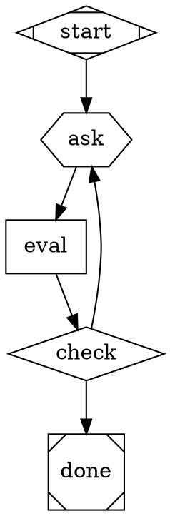
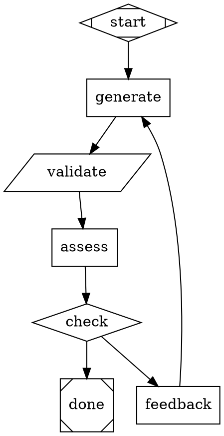
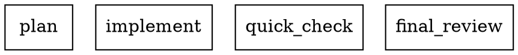
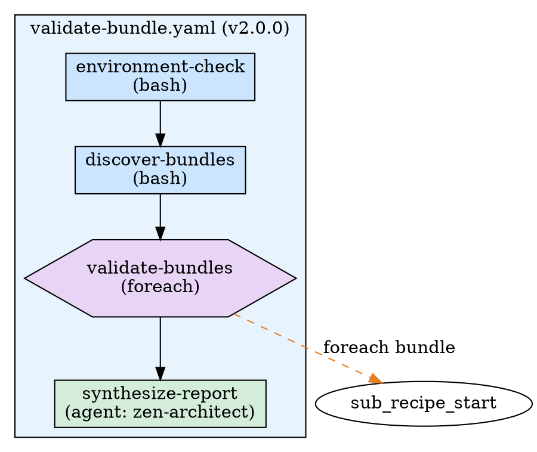

# DOT/Graphviz Concepts Deep Dive

> **Generated:** 2026-03-13 by session-analyst
> **Source sessions analyzed in depth:** 11 root sessions, ~1,200 turns of conversation
> **Focus:** Conceptual visions, technical patterns, design decisions, and unresolved questions about DOT across the Amplifier ecosystem

---

## Table of Contents

1. [The Grand Vision: Why DOT Matters](#1-the-grand-vision-why-dot-matters)
2. [Use-Case Taxonomy: Seven Distinct Roles for DOT](#2-use-case-taxonomy-seven-distinct-roles-for-dot)
3. [Technical Patterns: The DOT Code](#3-technical-patterns-the-dot-code)
4. [Design Decisions: The Conventions](#4-design-decisions-the-conventions)
5. [Tool & Capability Ideas](#5-tool--capability-ideas)
6. [Cross-Session Evolution: How the Thinking Changed](#6-cross-session-evolution-how-the-thinking-changed)
7. [Unresolved Questions & Open Debates](#7-unresolved-questions--open-debates)
8. [Key Quotes & "Aha Moments"](#8-key-quotes--aha-moments)

---

## 1. The Grand Vision: Why DOT Matters

### 1.1 The Dual-Purpose Format Thesis

The central conceptual breakthrough across sessions is that DOT serves as a **dual-purpose format** — simultaneously human-renderable AND agent-scannable. This emerged most clearly in session `1fe54592` (superpowers-test) where the user articulated the vision:

> *"I'd like to work on a project that would take a given repo, do a deep dive understanding of the repo and then produce a GraphViz DOT file representation of the system(s) represented within. The goal is that we should be able to point an LLM at the top level DOT file to get a rich understanding of the project(s) within the repo, and then if the project is large, it is broken down by subsystems with individual subgraph files that can be loaded up JIT based upon interest/need."*

This vision was refined in session `71295782` (dot-docs) through a key clarifying exchange:

**Assistant:** *"Who is the primary consumer of these DOT files — agents loading them as context, humans viewing rendered graphs, or both? If agents are the primary consumer, the DOT files should be optimized for token efficiency and structured so an LLM can reason over them (terse labels, semantic edge types, stable node IDs). If humans are the primary consumer, you'd optimize for visual clarity (descriptive labels, layout hints, color coding). If both, we'd need to figure out which to prioritize."*

The answer was **both** — and the design work that followed was about making a single DOT file serve both audiences without compromise.

### 1.2 DOT as the Universal Representation Layer

Across sessions, DOT emerged as the universal representation for five different layers of the Amplifier ecosystem:

1. **Pipeline execution** (Attractor) — DOT defines what agents do
2. **Architecture documentation** (Parallax) — DOT captures what systems are
3. **Event specification** (Change Proposal) — DOT specifies what happens
4. **Process visualization** (Skills) — DOT illustrates how workflows flow
5. **Recipe visualization** (Recipe Testing) — DOT renders how recipes compose

No other format in the ecosystem spans all five layers. YAML handles configuration, Markdown handles prose, Python handles logic — but DOT is the only format that captures **structure and relationships** in a way that is simultaneously machine-parseable, human-renderable, and LLM-interpretable.

### 1.3 The "Discovery Tool, Not Just Documentation" Principle

From session `9ed2c49f` (Parallax methodology), a key philosophical principle emerged: **DOT diagrams are discovery tools, not just documentation.** In the Parallax Discovery methodology, agents produce `diagram.dot` as a forcing function for precise understanding — the act of creating a DOT diagram requires the agent to commit to specific nodes, edges, and relationships, which prevents vague or hand-wavy analysis.

This was validated empirically in session `71295782` when comparing manual Wave 1 output to full 3-wave Parallax output:

> *"The 252-line synthesized diagram is qualitatively different from any Wave 1 diagram because it incorporates corrections. Wave 2 confirmed 3 bugs. Wave 3 then corrected the mechanisms of those bugs — `wrap_tool_with_hooks()` is dead code (not 'missing a call'), D-04 divergence only affects mixed pipelines (not all pipelines), and there's a 4th producer path for the token metric bug that code reading missed entirely."*

### 1.4 DOT as Stigmergic Coordination Surface

The team knowledge base design (referenced in session `71295782`) positioned DOT files as part of a **stigmergic coordination** pattern — agents coordinating through shared state rather than direct messaging. The per-person dotfiles directory is literally a shared landscape that agents read to understand what exists, what patterns to follow, and who owns what. DOT files are the visual representation of that landscape.

---

## 2. Use-Case Taxonomy: Seven Distinct Roles for DOT

### UC-1: Pipeline Definition Language (Attractor DSL)

**Sessions:** `4e7e1d72`, `b174ff67`, `588e215d`

DOT as the **native runtime format** for AI workflow execution. This is the most mature and technically deep use of DOT in the ecosystem. The Attractor engine parses `.dot` files and executes them as multi-agent pipelines.

**Key characteristics:**
- Each node is an LLM agent task with configurable behavior
- Edges define flow control: sequential, conditional, looping, fan-out/fan-in
- Node shapes map to handler types (semantic shape vocabulary)
- Node attributes configure LLM behavior (`llm_prompt`, `llm_provider`, `goal_gate`, `max_turns`)
- Edge attributes control routing (`condition`, `weight`, `loop_restart`, `fidelity`)
- CSS-like `model_stylesheet` enables multi-provider routing
- Supports composition via `shape=folder` (nested pipeline invocation)

**Scale:** 54 DOT pipeline files across tutorials, practical templates, patterns, and test fixtures in the attractor bundle alone.

### UC-2: Architecture Documentation (Parallax Discovery Output)

**Sessions:** `9ed2c49f`, `71295782`, `4e7e1d72`

DOT as the **standard output artifact** of every Parallax Discovery investigation. Each agent (Code Tracer, Behavior Observer, Integration Mapper) produces a `diagram.dot` alongside textual findings.

**Key characteristics:**
- Architecture diagrams showing module boundaries, dependencies, composition
- Integration maps showing cross-boundary data flows
- State machine diagrams showing lifecycle transitions
- Annotated with confirmed bugs (red nodes/edges)
- Cluster subgraphs for logical groupings
- Multiple perspectives synthesized into a single `architecture-diagram.dot`

### UC-3: Event System Specification

**Sessions:** `c95ce204`, `8ca877b9`

DOT as **formal specifications** for system event flows. 13+ numbered DOT files documenting the Amplifier event system.

**Specific DOT files created:**
- `02-session-state-machine.dot` — session lifecycle states and transitions
- `03-single-turn-event-flow.dot` — event sequence within a single turn
- `04-child-session-complete-lifecycle.dot` — child session lifecycle
- `05-orchestrator-variants.dot` — different orchestrator event emission patterns
- `06-recipe-session-tree.dot` — recipe session hierarchy
- `08-empirical-delegation-tree.dot` — delegation patterns observed empirically
- `09-hook-dispatch-flow.dot` — hook dispatch sequence
- `10-provider-vs-llm-events.dot` — provider/LLM event comparison
- `11-parallel-agent-mechanism.dot` — parallel agent coordination
- `13-navigation-graph-model.dot` — navigation graph structure
- `14-session-instance-55c8841a.dot` — specific real session instance diagram
- `15-query-parallel-tool-batches.dot` — parallel tool batch queries

**Key insight from this session:** DOT diagrams revealed a cancellation gap (G2) that was *"invisible because no diagram showed all exit paths"* — demonstrating DOT's value as a specification tool that forces completeness.

**Proposed convention (rejected by experts, see Section 7):** Modules that emit custom events should ship an `events.dot` file at the module root.

### UC-4: Progressive Disclosure Architecture (Dotfiles)

**Sessions:** `71295782`, `1fe54592`

DOT as the format for **per-person, per-repo architecture representations** in a team knowledge base, designed for progressive discovery:

```
Layer 0 — overview.dot (~200 lines)
  Agent reads ONE file and knows the shape of the system.
  
Layer 1 — architecture.dot, sequence.dot, state-machines.dot, integration.dot
  Agent reads only the perspectives relevant to its current task.
  
Layer 2 — Investigation artifacts (.investigation/)
  Full raw agent outputs, only read for deep forensics.
```

### UC-5: Recipe Visualization

**Session:** `bc1547a8`

DOT as a **visualization output format** for YAML recipe structures. The user asked for a GraphViz DOT representation of the bundle validation recipe and found it so valuable they immediately proposed:

> *"We should give this idea to recipe-author as part of its context, that it can offer to create Graphviz DOT file representations of recipes as ways for users to visually validate the way the recipes would work, this is REALLY helpful."*

**Visual encoding used:**
- Blue boxes = bash steps
- Green boxes = agent steps (LLM)
- Purple hexagons = foreach loops
- Yellow diamonds = condition gates
- Gray boxes = default/init steps
- Dashed orange edges = sub-recipe invocations

### UC-6: Process Flow Visualization (Skills)

**Sessions:** 14+ sessions loading brainstormer/superpowers skills

DOT embedded directly in Amplifier skill markdown files to define agent workflow processes. These are the process flow diagrams that guide agent behavior during brainstorming and superpowers modes.

### UC-7: Resolver Architecture Documentation

**Session:** `b174ff67`

DOT as architecture diagrams for each resolver in the amplifier-resolve system. The user explicitly requested:

> *"We need to create some .dot representations of the overall resolve stack (one file) and then one for each individual resolver."*

Each resolver repo (`amplifier-resolver-dot-graph`, `amplifier-resolver-session-loop`, etc.) includes a `docs/architecture.dot` diagram, plus an overall `resolve-architecture.dot` showing the plugin discovery mechanism.

---

## 3. Technical Patterns: The DOT Code

### 3.1 The Attractor Pipeline DSL — Shape-to-Handler Mapping

From session `4e7e1d72`, the complete semantic shape vocabulary for the Attractor pipeline DSL:

```dot
// Shape-to-handler mapping (Attractor pipeline engine)
// Each Graphviz shape maps to a specific execution handler

box         → codergen     // Standard LLM agent task node
diamond     → conditional  // Routing gate — evaluates edge conditions
component   → parallel     // Fan-out — dispatches parallel branches
tripleoctagon → fan_in     // Fan-in — waits for parallel branches to complete
hexagon     → wait.human   // Human-in-the-loop gate (pause for approval/input)
house       → stack.manager_loop  // Supervisor loop — repeatedly runs child pipeline
folder      → pipeline     // Nested pipeline invocation — loads separate .dot file
parallelogram → (tool node) // External tool/validation execution
Mdiamond    → (start node) // Pipeline entry point
Msquare     → (end node)   // Pipeline exit point
```

### 3.2 The Reusable Conversational Gate Pattern

From session `4e7e1d72`, a composable DOT subgraph for iterative human-AI interaction loops:



**Invoked from parent pipeline:**
```dot
gate1_decomposability [shape=folder, dot_file="patterns/conversational-gate.dot", 
    context.gate_topic="Rate this project's decomposability (0-100).",
    context.gate_criteria="Look for: feature count, independence between features.",
    context.gate_output_path=".ai/gate1_decomposability.md"]
```

**Key insight:** *"We don't need a new handler — the composition of hexagon + box + diamond + loop_restart edges gives us conversational loops within pure DOT."*

### 3.3 The Convergence Factory Pattern

From session `4e7e1d72`, a reusable generate-validate-refine loop:



**The "DOT that generates DOT" pattern** — the convergence factory can produce DOT files as artifacts:
```dot
generate_build_pipeline [shape=folder, dot_file="patterns/convergence-factory.dot",
    context.artifact_goal="A DOT pipeline for the build outer loop of project $project_name",
    context.artifact_path=".dev-machine/build.dot",
    context.validation_criteria="Valid DOT syntax, all required nodes present, correct edge conditions"]
```

### 3.4 The Model Stylesheet Pattern

From session `4e7e1d72`, CSS-like multi-provider routing within DOT:



Supports `*` (wildcard), `.class` (CSS class), and `#id` (specific node) selectors with CSS-like specificity.

### 3.5 The Tutorial Ladder (10 Progressive Examples)

From session `588e215d`/`4e7e1d72`, the attractor bundle ships a numbered tutorial sequence:

| File | Concept Introduced |
|------|-------------------|
| `01-simple-linear.dot` | Minimal start → implement → done |
| `02-plan-implement-test.dot` | Multi-node traversal, context flow |
| `03-conditional-routing.dot` | Diamond gates, edge conditions |
| `04-retry-with-fallback.dot` | `max_retries`, `retry_target`, `fallback_retry_target` |
| `05-parallel-fan-out.dot` | Fan-out/fan-in, `join_policy`, `error_policy` |
| `06-model-stylesheet.dot` | CSS-like multi-provider routing |
| `07-fidelity-modes.dot` | Context fidelity modes (`truncate`, `full`, `summary:*`, `compact`) |
| `08-human-gate.dot` | Hexagon human gates with accelerator keys |
| `09-manager-supervisor.dot` | House-shape manager loop with child subgraph |
| `10-full-attractor.dot` | Kitchen-sink demo — every feature at once |

### 3.6 Complex Real-World Pipelines

Two DOT files referenced across multiple sessions as canonical examples:

**`consensus_task.dot`** (7,365 bytes, 18 nodes) — Multi-LLM consensus pipeline:
```
Check DoD → Define DoD → parallel planning (Gemini + GPT + Opus) → 
Debate/Consolidate → Implement → parallel review (3 LLMs) → 
Consensus gate → Postmortem loop
```

**`semport.dot`** (10,355 bytes, 7 nodes) — Semantic porting loop:
```
Fetch upstream commits → Analyze → Finalize plan → Implement → 
Test/Validate → (pass: finalize ledger with git commit, fail: analyze failure) → loop
```

Uses GPT-5.2-codex and claude-sonnet-4-6 alternately via model stylesheet.

### 3.7 The Recipe-to-DOT Visualization Pattern

From session `bc1547a8`, DOT used to visualize YAML recipe structures:



---

## 4. Design Decisions: The Conventions

### 4.1 The Shape Vocabulary for Architecture Diagrams

From session `71295782` (dot-docs design), the agreed shape-as-type vocabulary for documentation DOT files (distinct from the Attractor DSL vocabulary):

| Shape | Meaning |
|-------|---------|
| `box` | Module / package |
| `ellipse` | Process / runtime entity |
| `component` | Orchestrator / coordinator |
| `hexagon` | Hook |
| `diamond` | Decision / transform |
| `cylinder` | State store |
| `note` | Config file |
| `box3d` | External dependency |

### 4.2 Edge Semantics

From session `71295782`:

| Edge Style | Meaning |
|-----------|---------|
| `solid` | Declared dependency (import, explicit reference) |
| `dashed` | Runtime / optional dependency |
| `dotted` | Coordinator-mediated interaction |
| `bold` | Critical path |

Cross-boundary edges show what data crosses and in which direction via edge labels.

### 4.3 Color Conventions

From session `71295782` and `4e7e1d72`:

| Color | Meaning |
|-------|---------|
| `red` | Confirmed bug (execution-proven) — nodes and edges |
| `orange` | Bypass path / spec deviation |
| `green` | Spec-correct / healthy |
| `blue` | Kernel / core layer |
| `purple` | Unified-LLM bypass path |

### 4.4 The overview.dot Contract

From session `71295782`, the quality standards for the top-level `overview.dot` file:

- **Target:** 150–250 lines, under 15KB
- **Must render standalone** as a readable image at normal viewing size
- **Must be agent-scannable** in minimal tokens — concise node labels (name + one-liner + key metric)
- **Uses cluster subgraphs** for logical groupings
- **Includes a rendered legend subgraph** (not comment-only)
- **Annotates known issues** — confirmed bugs get red nodes/edges
- **Uses the shape-as-type vocabulary** (Section 4.1)

### 4.5 Anti-Patterns

Documented across sessions `71295782` and `4e7e1d72`:

- **Node labels with multi-line inline documentation** — put detail in the detail files, not node labels
- **More than ~80 nodes in a single graph** — split into subgraphs/files
- **`splines=ortho` with high node counts** — causes rendering layout explosion
- **400+ line single-file DOT** — forensically thorough but unrenderable. Target 150–250 for top-level files, 200–400 for detail files.

### 4.6 The "Choose the Best Overview" Decision

From session `71295782`:

> *"The overview is always synthesized — not a copy of one agent's output, but a reconciled view incorporating corrections from all waves."*

The heuristic for which perspective becomes `overview.dot`:
- **Composition systems** → architecture/composition diagram
- **Execution engines** → execution flow or state-machine diagram
- **Libraries/toolkits** → architecture/dependency diagram
- **Repos with confirmed bugs** → whichever diagram best annotates them

This decision is **delegated to the synthesis agent**, not hardcoded.

---

## 5. Tool & Capability Ideas

### 5.1 DOT Validation Utilities

From session `71295782`, implemented in the dot-docs bundle:

- **Syntax validation:** Shell out to `dot -Tsvg` — invalid DOT is a hard failure
- **Line count gate:** Post-synthesis check that `overview.dot` is within 150–300 lines (warning, not blocker)
- **Render test:** Generate SVG and check non-zero bounding box (catches degenerate graphs)
- **Fixture-based regression:** Assert produced `overview.dot` contains expected subgraph names and node IDs

### 5.2 Structural Change Detection for Tiered Refresh

From session `71295782`:

```python
# Determine if a repo change is structural (triggers Tier 2 refresh)
# git diff --stat against last-analyzed commit
# Filter to: *.py, *.rs, *.ts, pyproject.toml, Cargo.toml, package.json, *.yaml
# If files in module roots were added/removed, or >20% of tracked files changed → structural
```

### 5.3 Recipe-to-DOT Generator

From session `bc1547a8`, the idea that recipe-author should be able to generate DOT representations of recipes. This was explicitly parked for later:

> *"Let's set the DOT diagrams aside as a separate thing... we'll consider actually even further expanding what we do (maybe even a separate dot specific bundle) when we're ready later."*

### 5.4 Generated Event Flow DOT (vs. Hand-Maintained)

From session `c95ce204`, the expert consensus was:

> **Foundation-expert:** *"Hand-maintained DOT files won't be maintained. Generate from source."*
> **Zen-architect:** *"Process overhead that rots."*

The recommended approach: write a script that introspects `mount()` functions and `hooks.emit()` calls across modules and **generates** DOT diagrams from source — one generated artifact for the whole system, never hand-maintained.

### 5.5 Dynamic DOT Generation (DOT that produces DOT)

From session `4e7e1d72`, the pattern where a pipeline node generates a DOT file that a subsequent node executes:

```dot
generate_build_dot [shape=box, prompt="Read .dev-machine-design.md. Generate the build pipeline DOT file. Write to .dev-machine/build.dot."]
smoke_test [shape=folder, dot_file=".dev-machine/build.dot"]
```

This was identified as needing verification but likely works with existing primitives.

### 5.6 Provider Extraction from DOT

From session `4e7e1d72`, the attractor engine needs `_extract_required_providers()` to parse `llm_provider` from node attributes and `model_stylesheet` rules in DOT source. This was implemented as part of the NF-03 fix.

---

## 6. Cross-Session Evolution: How the Thinking Changed

### Phase 1: DOT as Existing Pipeline Format (Feb 27 – Mar 3)

Sessions `b174ff67` and `b6381c4b` established DOT as the **pipeline execution format** for `amplifier-resolve`. The `DotGraphResolver` was built as the production default, replacing the legacy `FivePhaseResolver`. Key early work:

- Built `resolve_quick.dot` (8 nodes) and `resolve_consensus.dot` (15 nodes)
- Discovered painful gotchas: `llm_prompt` vs `prompt` confusion, `shape="diamond"` silently mapping to wrong handler, custom outcome conditions not matching
- Established the pattern of user-provided DOT files — shifted from generating DOT strings to loading DOT from disk

### Phase 2: DOT as Investigation Artifact (Mar 5 – Mar 10)

Sessions `c95ce204` and `9ed2c49f` expanded DOT's role from "pipeline definition" to **specification and investigation output**:

- Created 13+ DOT files as formal event system specifications
- Established `diagram.dot` as a standard Parallax Discovery output artifact
- Proposed (and later debated) the convention of modules shipping `events.dot`
- Key philosophical shift: DOT is a "discovery tool, not just documentation"

### Phase 3: DOT as Architecture Representation (Mar 10 – Mar 12)

Sessions `1fe54592`, `71295782`, and `4e7e1d72` elevated DOT to **the format for representing system architecture**:

- Defined the dual-purpose vision (human-renderable + agent-scannable)
- Ran experiments comparing investigation approaches (manual Wave 1 vs full Parallax)
- Established quality standards, shape vocabulary, edge semantics
- Built working tooling (dot-docs bundle) with 247 tests
- Ran the pipeline against real repos (amplifier-bundle-modes, amplifier-resolve)
- Discovered the "gem" metric: 158-line state-machine diagram as the optimal size

### Phase 4: DOT as Composable Workflow Primitive (Mar 10 – Mar 12)

Session `4e7e1d72` pushed DOT into **reusable composable patterns**:

- Designed the conversational-gate pattern (hexagon + box + diamond + loop_restart)
- Designed the convergence-factory pattern (generate → validate → assess → feedback → loop)
- Explored "DOT that generates DOT" (foundry producing bespoke pipelines)
- Catalogued all 54 DOT files in the attractor bundle ecosystem
- Mapped the full prerequisite set for DOT-based dev-machine conversion

### Phase 5: DOT as Ecosystem-Wide Format (Mar 12 – Mar 13)

Sessions `bc1547a8` and `a31d8d0c` (this project's parent) began consolidating DOT into a **dedicated bundle**:

- Recipe-to-DOT visualization proved valuable, user requested it as a standard recipe-author capability
- The dot-graph-bundle project was initiated to formalize DOT capabilities across the ecosystem
- Session index created (this document's companion) mapping all DOT usage

### Key Evolution Arc

```
Pipeline DSL → Investigation Artifact → System Specification →
Architecture Representation → Composable Workflow Primitive →
Ecosystem-Wide Format
```

Each phase **added** a new use case without replacing the previous ones. DOT's role only expanded.

---

## 7. Unresolved Questions & Open Debates

### Q1: Hand-Maintained vs. Generated DOT

**The tension:** Session `c95ce204` proposed that modules ship hand-maintained `events.dot` files. Three experts independently rejected this:

> **Foundation-expert:** *"Hand-maintained DOT files won't be maintained. Generate from source."*
> **Zen-architect:** *"Process overhead that rots."*

But session `71295782` designed a system that produces DOT via LLM investigation (Parallax Discovery) — which is neither hand-maintained nor deterministically generated. It's **LLM-synthesized from structured investigation**.

**Unresolved:** What's the right boundary between generated-from-source DOT (cheap, deterministic, limited to structural relationships) and LLM-synthesized DOT (expensive, richer, captures behavioral insights)? The dot-docs design uses tiered refresh (full Parallax → single-wave → targeted update) but the threshold criteria are still being refined.

### Q2: Auto-Approve Thresholds

From session `71295782`:

> *"At what confidence level should Tier 2 refreshes auto-approve Wave 1 findings without human gates? Should there be a quality score on the synthesis output?"*

No resolution reached. The full Parallax Discovery recipe has approval gates between waves. For routine dotfiles refresh, these gates add friction. But auto-approving incorrect diagrams is worse than stale diagrams.

### Q3: Cross-Repo DOT References

From session `71295782`:

> *"When one repo depends on another (e.g., attractor depends on amplifier-core), should the DOT files reference each other's overview.dot via URL or subgraph include?"*

No resolution reached. The directory structure (`dotfiles/<handle>/<repo>/`) is per-repo, but real systems span repos.

### Q4: DOT File Rendering Pipeline

From sessions `71295782` and `b174ff67`:

> *"Should the pipeline also produce rendered SVG/PNG alongside the DOT source?"*

Session `b174ff67` showed the pain of DOT rendering in the resolve dashboard — `graph.dot` files were present but `ts-graphviz` in the React frontend had parsing issues, producing "unlinked boxes instead of connected graph." The DOT source was valid; the rendering pipeline was fragile.

### Q5: Two Different Shape Vocabularies

**The conflict:** The Attractor pipeline DSL uses shapes to map to *execution handlers* (box=codergen, diamond=conditional, hexagon=human-gate). The dot-docs design uses shapes to represent *entity types* (box=module, diamond=decision, hexagon=hook). These two vocabularies **overlap but disagree** on what shapes mean.

**Unresolved:** Should the dot-graph-bundle establish a single unified vocabulary, or explicitly document two separate vocabularies (one for pipelines, one for architecture diagrams)? Is there a risk that an LLM reading a DOT file can't tell which vocabulary is in use?

### Q6: Context Variable Injection into Child Pipelines

From session `4e7e1d72`:

> *"Does the PipelineHandler support `context.*` attributes on the invoking node that get merged into the child's cloned context?"*

This is critical for the reusable subgraph pattern. Without it, every subgraph invocation needs a separate DOT file with hardcoded prompts instead of parameterized `$variable` references. Identified as prerequisite P7 — needs verification.

### Q7: The events.dot Convention — Accept or Reject?

Session `c95ce204` proposed it. Three experts rejected it. But the DOT specification files created in that session (13+ diagrams) were extremely valuable for understanding the event system. The question is whether the *convention* (every module ships one) was bad, or the *mechanism* (hand-maintained) was bad. If the mechanism were "auto-generated from source," would the convention be worth reviving?

### Q8: Parallelism Across Repos

From session `71295782`:

> *"Can multiple repos be investigated simultaneously, or should the orchestrator process them sequentially to avoid rate-limit issues with LLM providers?"*

The Parallax Discovery recipe already dispatches 6+ agents in parallel per wave. Running multiple repos simultaneously would multiply the parallelism. No resolution on LLM rate-limit management for high-parallelism dotfiles refresh.

---

## 8. Key Quotes & "Aha Moments"

### On the dual-purpose format vision
> *"The goal is that we should be able to point an LLM at the top level DOT file to get a rich understanding of the project(s) within the repo, and then if the project is large, it is broken down by subsystems with individual subgraph files that can be loaded up JIT based upon interest/need."*
— User, session `1fe54592`

### On DOT as a discovery forcing function
> *"DOT diagrams are discovery tools, not just documentation."*
— Parallax methodology, session `9ed2c49f`

### On why full investigation matters
> *"The 252-line synthesized diagram is qualitatively different from any Wave 1 diagram because it incorporates corrections."*
— Assistant, session `71295782`

### On the optimal DOT file size
> *"The gem was β-agent-2's state machine diagram — 158 lines, ~9KB, renders beautifully, and an agent could consume it in minimal tokens. The walls were the code-tracer outputs (411 and 587 lines) — forensically thorough but would never render as a readable image."*
— Assistant, session `71295782`

### On the conversational gate composition
> *"We don't need a new handler — the composition of hexagon + box + diamond + loop_restart edges gives us conversational loops within pure DOT."*
— Assistant, session `4e7e1d72`

### On DOT that generates DOT
> *"A DOT pipeline foundry that produces DOT pipelines. Beautiful recursion."*
— Assistant, session `4e7e1d72`

### On recipe visualization value
> *"We should give this idea to recipe-author as part of its context, that it can offer to create Graphviz DOT file representations of recipes as ways for users to visually validate the way the recipes would work, this is REALLY helpful."*
— User, session `bc1547a8`

### On why hand-maintained DOT fails
> *"Hand-maintained DOT files won't be maintained. Generate from source."*
— Foundation-expert, session `c95ce204`

### On the cancellation gap
> *"The cancellation gap (G2) was invisible because no diagram showed all exit paths."*
— From DOT specification work, session `c95ce204`

### On progressive disclosure with DOT
> *"Maybe there needs to be ONE top level file that is the most appropriate representation per repo (giving some agency to the 'agent' or other process that does this work) and then everything else is linked/crawlable from there?"*
— User, session `71295782`

### On preferring language tools for accuracy
> *"We want to explore building tooling for performing the discovery necessary for creating these representations accurately, preferring leveraging language tools over 'understanding' through 'reading' files, etc. where possible, or really a combination approach to ensure a proper understanding."*
— User, session `71295782`

### On the pipeline DSL design choice
> *"The pipeline format is Graphviz DOT digraph syntax with a strict constrained subset — one digraph per file. Attractor lets pipeline authors express workflows as Graphviz DOT digraphs. Each node is an AI task (or control node), edges define flow."*
— From Attractor bundle analysis, session `4e7e1d72`

---

## Appendix: Session Cross-Reference

| Concept | Primary Session | Supporting Sessions |
|---------|----------------|-------------------|
| Dual-purpose format (human + agent) | `1fe54592` | `71295782` |
| Shape vocabulary (architecture) | `71295782` | |
| Shape vocabulary (pipeline DSL) | `4e7e1d72` | `b174ff67` |
| Edge semantics | `71295782` | |
| overview.dot contract | `71295782` | |
| Tiered discovery (Tier 1/2/3) | `71295782` | |
| Parallax DOT output spec | `9ed2c49f` | `71295782` |
| Event system DOT specs | `c95ce204` | `8ca877b9` |
| DotGraphResolver | `b174ff67` | `b6381c4b`, `2d7eecf6` |
| Pipeline DOT files (quick/consensus) | `b174ff67` | `b6381c4b` |
| Conversational gate pattern | `4e7e1d72` | |
| Convergence factory pattern | `4e7e1d72` | |
| DOT-that-generates-DOT | `4e7e1d72` | |
| Model stylesheet | `4e7e1d72` | `588e215d` |
| Recipe-to-DOT visualization | `bc1547a8` | |
| 54 DOT files in attractor | `588e215d` | `4e7e1d72` |
| Hand-maintained vs generated debate | `c95ce204` | `71295782` |
| Resolver plugin architecture with DOT | `b174ff67` | |
