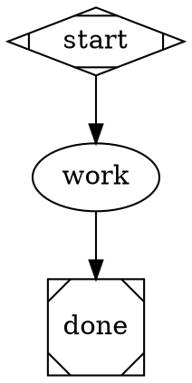
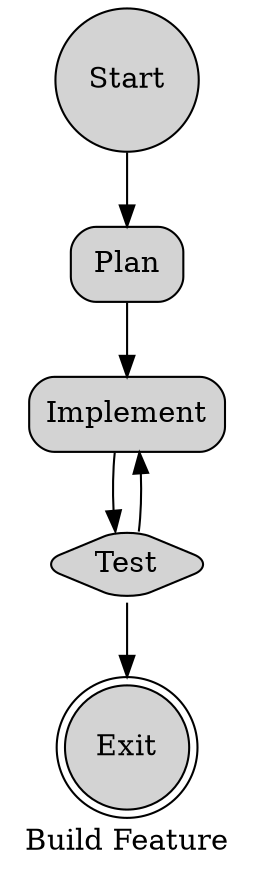
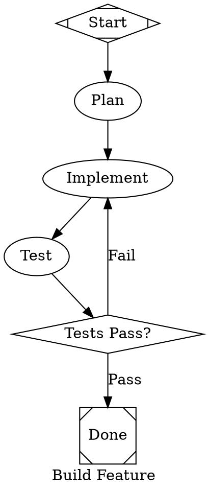

# DOT Dialect Comparison: Two Approaches to AI Pipeline Graphs

Two distinct dialects of DOT have emerged in the Amplifier ecosystem for encoding
AI agent pipelines. Both extend standard Graphviz DOT with custom attributes, but
they differ fundamentally in *how* they encode pipeline semantics. This document
is a comprehensive side-by-side analysis.

## Overview

| Aspect | **node_type Dialect** | **Attractor Shape Dialect** |
|---|---|---|
| Exemplars | `consensus_task.dot`, `semport.dot` | `amplifier-bundle-attractor/examples/` |
| Node role mechanism | Explicit `node_type` attribute | DOT `shape` attribute as semantic dispatch |
| Model selection | Inline per-node (`llm_provider`, `llm_model`) | CSS-like `model_stylesheet` + `class` |
| Prompt attribute | `llm_prompt` | `prompt` |
| Shape meaning | Decorative (visual hint only) | Semantic (determines handler) |
| Typical author | Hand-authored by humans or GUI tools | Designed for LLM generation |

---

## 1. Syntax Differences

### 1.1 How Node Roles Are Declared

**node_type dialect** — Every node carries an explicit `node_type` attribute that
tells the runtime what handler to invoke. Shapes are decorative suggestions that
happen to mirror the role visually, but carry no semantic weight:

```dot
// node_type dialect: role is in the attribute, shape is decoration
Start [
    node_type="start", shape="circle",
    label="Start", style="rounded,filled"
]

CheckDoD [
    node_type="stack.steer", shape="diamond",
    label="Check DoD", style="rounded,filled"
]

Implement [
    node_type="stack.observe", shape="box",
    label="Implement (Opus)", style="rounded,filled"
]

Exit [
    node_type="exit", shape="doublecircle",
    label="Exit", style="rounded,filled"
]
```

**Attractor dialect** — The DOT `shape` attribute *is* the semantic dispatch key.
No separate `node_type` attribute exists. The runtime maps shapes to handlers:

```dot
// Attractor dialect: shape IS the role
start [shape=Mdiamond, label="Start"]          // → start handler
done  [shape=Msquare, label="Done"]            // → exit handler
plan  [label="Plan", prompt="..."]             // → codergen (default box)
gate  [shape=diamond, label="Tests Pass?"]     // → conditional routing
ask   [shape=hexagon, label="Approve?"]        // → human-in-the-loop
par   [shape=component, label="Fan Out"]       // → parallel handler
join  [shape=tripleoctagon, label="Collect"]   // → fan-in handler
mgr   [shape=house, label="Supervise"]         // → manager/supervisor loop
sub   [shape=folder, dot_file="child.dot"]     // → nested sub-pipeline
tool  [shape=parallelogram, tool_command=".."] // → tool execution
```

### 1.2 Shape-to-Handler Mapping (Attractor Only)

The Attractor dialect defines a rich vocabulary of shapes, each wired to a
specific runtime handler:

| Shape | Handler | Purpose |
|---|---|---|
| `Mdiamond` | start | Pipeline entry point |
| `Msquare` | exit | Pipeline exit point |
| `box` *(default)* | codergen | LLM agent work node |
| `diamond` | conditional | Route based on edge conditions |
| `hexagon` | wait.human | Block until human selects a choice |
| `component` | parallel | Fan-out to parallel branches |
| `tripleoctagon` | fan_in | Collect parallel branch results |
| `house` | manager_loop | Supervisor/manager OEA cycle |
| `folder` | nested | Invoke a child `.dot` pipeline |
| `parallelogram` | tool | Run a shell command |

### 1.3 node_type Vocabulary (node_type Dialect Only)

The node_type dialect uses a namespace-dot convention:

| node_type | Equivalent Attractor Shape | Purpose |
|---|---|---|
| `start` | `Mdiamond` | Entry point |
| `exit` | `Msquare` | Exit point |
| `stack.observe` | `box` (codergen) | LLM work node (observe, no routing) |
| `stack.steer` | `diamond` or `box` with conditions | LLM work node that sets routing outcome |

The node_type vocabulary is notably smaller — only four values appear across the
examined files. There are no equivalents for human gates, parallel fan-out,
fan-in, manager loops, nested pipelines, or tool execution.

### 1.4 Prompt Attribute

```dot
// node_type dialect
CheckDoD [
    node_type="stack.steer",
    llm_prompt="Check if definition of done provided.\n\nTASK: $task\n..."
]

// Attractor dialect
plan [
    label="Plan",
    prompt="Create an implementation plan for: $goal\n..."
]
```

The node_type dialect uses `llm_prompt`; Attractor uses `prompt`. Both support
`$variable` expansion, but they reference different graph-level variables (`$task`
vs `$goal`).

### 1.5 Edge Syntax

Both dialects use conditions on edges, but with slightly different patterns:

```dot
// node_type dialect: condition attribute on edges
CheckDoD -> DefineDoD_Gemini [condition="outcome=needs_dod"];
CheckDoD -> PlanGemini [condition="outcome=has_dod"];
ReviewConsensus -> Exit [condition="outcome=yes"];
Postmortem -> PlanGemini [loop_restart="true"];

// Attractor dialect: condition + weight + label
gate -> done [label="Yes", condition="outcome=success", weight=10]
gate -> fix  [label="No",  condition="outcome!=success", weight=5]
fix -> test  // unconditional

// Attractor also supports context.* conditions
check -> done     [condition="context.preferred_label=converged"]
check -> feedback [condition="context.preferred_label=refine"]
```

Key differences:
- Attractor supports `!=` (negation) in conditions; node_type dialect uses only `=`
- Attractor uses `weight` to influence edge selection priority
- Attractor supports `context.*` deep conditions against pipeline state
- Both share `loop_restart="true"` for cycle-back edges
- Attractor puts `fidelity` and `thread_id` on edges (not seen in node_type dialect)

---

## 2. Execution Model

### 2.1 Node Handler Dispatch

**node_type dialect:**
The runtime reads `node_type` and dispatches to the corresponding handler. The
`stack.observe` vs `stack.steer` distinction determines whether the node merely
performs work (observe) or also produces a routing outcome (steer). This is a
two-axis system: *what kind of work* (stack) × *whether it routes* (observe/steer).

**Attractor dialect:**
The runtime reads `shape` and dispatches directly. A plain `box` node (or any node
without an explicit shape) is a codergen work node. A `diamond` is a conditional
gate. There is no observe/steer axis — instead, any codergen node can set
`preferred_label` in its response, and a separate diamond node reads that value
to route. The routing responsibility is architecturally separated from the work.

### 2.2 Routing Architecture

**node_type dialect — unified routing:**
A `stack.steer` node does LLM work *and* makes the routing decision in a single
step. The node's `llm_prompt` instructs the agent to write `outcome=X`, and the
engine evaluates outgoing edge conditions against that outcome:

```dot
CheckDoD [
    node_type="stack.steer",
    llm_prompt="...Write status.json with outcome=needs_dod if DOD is empty..."
]
CheckDoD -> DefineDoD_Gemini [condition="outcome=needs_dod"];
CheckDoD -> PlanGemini       [condition="outcome=has_dod"];
```

**Attractor — separated routing:**
Work nodes produce results; separate diamond/hexagon nodes consume those results
to make routing decisions. This creates a two-node pattern (work → gate):

```dot
test [label="Run Tests", prompt="...Report success if all tests pass..."]
gate [shape=diamond, label="Tests Pass?"]

test -> gate
gate -> done [condition="outcome=success"]
gate -> fix  [condition="outcome!=success"]
```

The Attractor separation is more explicit but adds nodes. The node_type dialect
is more compact (fewer nodes) but couples work with routing.

### 2.3 Parallel Execution

**node_type dialect — implicit fan-out:**
Parallelism is expressed through graph topology alone. When a steer node has
multiple outgoing edges with the same condition, all matching targets run in
parallel:

```dot
// Three nodes fan out implicitly from CheckDoD
CheckDoD -> DefineDoD_Gemini [condition="outcome=needs_dod"];
CheckDoD -> DefineDoD_GPT    [condition="outcome=needs_dod"];
CheckDoD -> DefineDoD_Opus   [condition="outcome=needs_dod"];
// All three converge back (implicit fan-in)
DefineDoD_Gemini -> ConsolidateDoD;
DefineDoD_GPT    -> ConsolidateDoD;
DefineDoD_Opus   -> ConsolidateDoD;
```

**Attractor — explicit fan-out/fan-in nodes:**
Parallel execution requires dedicated `component` (fan-out) and `tripleoctagon`
(fan-in) nodes with explicit configuration:

```dot
parallel_impl [
    shape=component,
    label="Implement in Parallel",
    join_policy="wait_all",
    error_policy="continue",
    max_parallel=3
]
collect [shape=tripleoctagon, label="Collect"]

parallel_impl -> impl_core
parallel_impl -> impl_api
parallel_impl -> impl_tests
impl_core  -> collect
impl_api   -> collect
impl_tests -> collect
```

The Attractor approach gives more control (`join_policy`, `error_policy`,
`max_parallel`) but requires two extra structural nodes per parallel section.

### 2.4 Context and Fidelity

**node_type dialect:**
- `context_fidelity_default` and `context_thread_default` at graph level
- No per-node or per-edge fidelity overrides observed

**Attractor dialect:**
- Hierarchical fidelity resolution: edge > node > graph default
- Per-node `fidelity` attribute with rich modes: `full`, `compact`, `truncate`, `summary:low/medium/high`
- Per-node `thread_id` for LLM session reuse across stages
- Per-edge `fidelity` and `thread_id` overrides (highest precedence)

```dot
// Attractor fidelity cascade
graph [default_fidelity="compact"]

architect [fidelity="truncate"]                       // node overrides graph
implement_auth [fidelity="full", thread_id="api-impl"] // shares session
implement_rate_limit [fidelity="full", thread_id="api-impl"] // same session

integration_test -> final_review [fidelity="summary:high"] // edge overrides all
```

---

## 3. Model Selection

### 3.1 node_type Dialect: Inline Per-Node

Every node carries its full LLM configuration explicitly:

```dot
DefineDoD_Gemini [
    node_type="stack.observe",
    is_codergen="true",
    llm_provider="gemini",
    llm_model="gemini-3-flash-preview",
    max_agent_turns="6",
    timeout="300",
    llm_prompt="..."
]

ReviewGPT [
    node_type="stack.observe",
    is_codergen="true",
    llm_provider="openai",
    llm_model="gpt-5.2-2025-12-11",
    max_agent_turns="6",
    timeout="300",
    reasoning_effort="high",
    llm_prompt="..."
]
```

This is explicit but repetitive. In `consensus_task.dot`, the string
`is_codergen="true"` appears 14 times, `llm_provider="anthropic"` appears 10
times, and `timeout="300"` appears 7 times.

### 3.2 Attractor Dialect: CSS-Like Model Stylesheet

Model assignment is centralized in a `model_stylesheet` with CSS-like selectors:

```dot
graph [
    model_stylesheet="
        * {
            llm_model: claude-sonnet-4-20250514;
            llm_provider: anthropic;
            reasoning_effort: medium;
        }
        .planning {
            llm_model: o3;
            llm_provider: openai;
            reasoning_effort: high;
        }
        .code {
            llm_model: claude-sonnet-4-20250514;
            llm_provider: anthropic;
        }
        .fast {
            llm_model: gemini-2.5-flash-preview-05-20;
            llm_provider: gemini;
            reasoning_effort: low;
        }
        #critical_review {
            llm_model: claude-opus-4-20250514;
            llm_provider: anthropic;
            reasoning_effort: high;
        }
    "
]

// Nodes just declare their class — model resolved by stylesheet
plan            [label="Plan Feature",    class="planning"]
implement       [label="Implement",       class="code"]
lint_check      [label="Lint Check",      class="fast"]
critical_review [label="Critical Review", class="code"]  // #id overrides .code
```

Specificity rules mirror CSS: `node attribute > #id > .class > *`

---

## 4. Custom Attributes Inventory

### 4.1 node_type Dialect — Custom Node Attributes

| Attribute | Type | Example | Purpose |
|---|---|---|---|
| `node_type` | string | `"start"`, `"stack.observe"`, `"stack.steer"`, `"exit"` | Handler dispatch key |
| `is_codergen` | string-bool | `"true"` | Marks node as LLM-driven |
| `llm_provider` | string | `"anthropic"`, `"openai"`, `"gemini"` | LLM provider |
| `llm_model` | string | `"claude-opus-4-5"`, `"gpt-5.1"` | Model identifier |
| `llm_prompt` | string | *(multi-line)* | Agent prompt |
| `max_agent_turns` | string-int | `"8"` | Max LLM turns per node |
| `timeout` | string-int | `"1200"` | Node timeout in seconds |
| `reasoning_effort` | string | `"high"` | Model reasoning effort |
| `allow_partial` | string-bool | `"true"` | Accept partial results |

### 4.2 node_type Dialect — Custom Edge Attributes

| Attribute | Type | Example | Purpose |
|---|---|---|---|
| `condition` | string | `"outcome=needs_dod"` | Routing condition |
| `loop_restart` | string-bool | `"true"` | Marks edge as cycle-back |

### 4.3 node_type Dialect — Custom Graph Attributes

| Attribute | Type | Example | Purpose |
|---|---|---|---|
| `goal` | string | `"$task"` | Pipeline goal description |
| `context_fidelity_default` | string | `"truncate"` | Default context fidelity |
| `context_thread_default` | string | `"consensus-task"` | Default thread ID |
| `default_max_retry` | string-int | `"3"` | Max retry count |
| `retry_target` | string | `"CheckDoD"` | Default retry destination |
| `fallback_retry_target` | string | `"Start"` | Fallback after retries exhausted |

### 4.4 Attractor Dialect — Custom Node Attributes

| Attribute | Type | Example | Purpose |
|---|---|---|---|
| `prompt` | string | *(multi-line)* | Agent prompt |
| `class` | string | `"planning"`, `"code"` | Model stylesheet selector |
| `fidelity` | string | `"full"`, `"summary:high"` | Context fidelity mode |
| `thread_id` | string | `"api-impl"` | LLM session reuse |
| `goal_gate` | boolean | `true` | Must-pass gate |
| `max_retries` | integer | `2` | Per-node retry limit |
| `retry_target` | string | `"plan"` | Where to retry on failure |
| `fallback_retry_target` | string | `"simple_implement"` | Fallback target |
| `allow_partial` | boolean | `true` | Accept partial results |
| `join_policy` | string | `"wait_all"` | Parallel join strategy |
| `error_policy` | string | `"continue"`, `"fail_fast"` | Parallel error handling |
| `max_parallel` | integer | `3` | Max concurrent branches |
| `dot_file` | string | `"child.dot"` | Nested pipeline path |
| `context.*` | string | *(various)* | Injected context for child pipelines |
| `tool_command` | string | `"$validation_command"` | Shell command for tool nodes |
| `manager.max_cycles` | integer | `5` | Manager loop limit |
| `manager.poll_interval` | string | `"0s"` | Manager polling interval |
| `manager.stop_condition` | string | `"outcome=success"` | Manager exit condition |
| `manager.actions` | string | `"observe,steer,wait"` | Manager action set |
| `llm_model` | string | *(override)* | Per-node model override |
| `llm_provider` | string | *(override)* | Per-node provider override |

### 4.5 Attractor Dialect — Custom Edge Attributes

| Attribute | Type | Example | Purpose |
|---|---|---|---|
| `condition` | string | `"outcome=success"`, `"outcome!=success"` | Routing condition |
| `weight` | integer | `10` | Edge selection priority |
| `fidelity` | string | `"summary:high"` | Override context fidelity |
| `thread_id` | string | `"review-thread"` | Override session thread |
| `loop_restart` | string-bool | `"true"` | Marks edge as cycle-back |

### 4.6 Attractor Dialect — Custom Graph Attributes

| Attribute | Type | Example | Purpose |
|---|---|---|---|
| `goal` | string | *(description)* | Pipeline goal |
| `model_stylesheet` | string | *(CSS-like block)* | Centralized model config |
| `default_fidelity` | string | `"compact"` | Default fidelity mode |
| `default_thread_id` | string | `"feature-build"` | Default session thread |
| `default_max_retry` | integer | `3` | Max retry count |
| `retry_target` | string | `"plan"` | Default retry destination |
| `fallback_retry_target` | string | `"plan"` | Fallback target |

---

## 5. Expressiveness

### 5.1 What node_type Can Express That Attractor Cannot

| Capability | How node_type Does It | Attractor Equivalent |
|---|---|---|
| **Observe/steer distinction** | `stack.observe` vs `stack.steer` | No direct equivalent; work and routing are separated into different nodes |
| **Multi-model consensus** | Naturally — same prompt dispatched to 3 providers, results merged | Possible via parallel fan-out, but less idiomatic |
| **Per-node model pinning** | Every node explicitly declares its model | Possible via per-node `llm_model` override, but the stylesheet is preferred |
| **Compact single-node routing** | A `stack.steer` node does work + routes in one step | Requires work node + separate diamond gate (2 nodes) |

The node_type dialect's killer pattern is **multi-model consensus**: the
`consensus_task.dot` file sends the same prompt to Claude, GPT, and Gemini in
parallel, then consolidates. This pattern is natural because each node explicitly
carries its provider. In Attractor, you'd need separate class overrides or
per-node `llm_model` attributes.

### 5.2 What Attractor Can Express That node_type Cannot

| Capability | How Attractor Does It | node_type Equivalent |
|---|---|---|
| **Human-in-the-loop gates** | `shape=hexagon` with accelerator keys from edge labels | Not supported |
| **Parallel fan-out/fan-in** | `shape=component` + `shape=tripleoctagon` with policy control | Implicit via topology (no policy control) |
| **Manager/supervisor loops** | `shape=house` with `manager.*` attributes | Not supported |
| **Nested sub-pipelines** | `shape=folder` with `dot_file` + `context.*` injection | Not supported |
| **Tool/command execution** | `shape=parallelogram` with `tool_command` | Not supported |
| **CSS-like model stylesheet** | `model_stylesheet` with `*`, `.class`, `#id` selectors | Not supported (inline per-node only) |
| **Hierarchical fidelity** | Edge > node > graph precedence with 5+ modes | Graph-level default only |
| **Session threading** | `thread_id` for cross-node LLM session reuse | `context_thread_default` only |
| **Edge weights** | `weight` attribute for prioritized condition matching | Not supported |
| **Negated conditions** | `condition="outcome!=success"` | Not observed |
| **Reusable patterns** | `folder` nodes composing child pipelines with context injection | Not supported |

The Attractor dialect is substantially more expressive. It encodes 10 distinct
node types compared to 4, and provides structured control over parallelism,
human interaction, supervisor patterns, and pipeline composition.

---

## 6. LLM-Friendliness

### 6.1 Generation Complexity

**node_type dialect — harder to generate correctly:**

- Every node requires 5-7 boilerplate attributes (`is_codergen`, `llm_provider`,
  `llm_model`, `max_agent_turns`, `timeout`, `node_type`, visual attrs)
- The prompt key (`llm_prompt`) and the type key (`node_type`) are non-standard
  attribute names an LLM must remember
- Visual attributes (`color`, `fillcolor`, `fontname`, `fontsize`, `margin`,
  `penwidth`) are mixed with semantic attributes, adding noise
- String-encoded booleans and integers (`"true"`, `"300"`) rather than native types
- The `stack.observe` vs `stack.steer` distinction requires understanding the
  OEA (Observe-Evaluate-Act) framework

**Attractor dialect — easier to generate correctly:**

- Minimal required attributes: just `label` and `prompt` for a work node
- Shape vocabulary is finite and well-defined (10 shapes)
- Model selection is centralized in the stylesheet — nodes don't need it
- Native DOT types where possible (`max_retries=2` not `max_retries="2"`)
- Clean separation: structural nodes have shapes, work nodes have prompts
- The simplest valid pipeline is 5 lines:



### 6.2 Error Surface

| Error Type | node_type Risk | Attractor Risk |
|---|---|---|
| Forgetting `node_type` | High — runtime can't dispatch | N/A — shape or default handles it |
| Forgetting `is_codergen` | High — node won't call LLM | N/A — shape implies handler |
| Wrong model on a node | High — must repeat correctly per-node | Low — stylesheet handles it |
| Inconsistent visual attrs | Medium — lots of repeated style attrs | Low — structural nodes are sparse |
| Invalid shape name | N/A — shapes are decorative | Medium — wrong shape = wrong handler |
| Mismatched observe/steer | Medium — wrong type = broken routing | N/A — no such distinction |

### 6.3 Token Efficiency

A typical work node in each dialect:

**node_type dialect (~180 tokens):**
```dot
ReviewGemini [
    node_type="stack.observe", label="Review (Gemini)", shape="box",
    style="rounded,filled", is_codergen="true", llm_provider="gemini",
    llm_model="gemini-3-flash-preview", max_agent_turns="6", timeout="300",
    llm_prompt="Review implementation.\n\nTASK: $task\n\nWrite review."
]
```

**Attractor dialect (~50 tokens):**
```dot
review [
    label="Review",
    class="fast",
    prompt="Review implementation for: $goal. Write review."
]
```

The Attractor dialect is roughly **3-4× more token-efficient** per node due to
the stylesheet absorbing model configuration and shape absorbing type declaration.

### 6.4 Verdict

The Attractor dialect is significantly more LLM-friendly:
- **Lower error surface**: fewer required attributes per node
- **Better defaults**: shape=box → codergen, no explicit `is_codergen` needed
- **Centralized config**: model stylesheet eliminates per-node repetition
- **Cleaner signal**: semantic attributes aren't buried in visual noise
- **Cheaper generation**: ~3-4× fewer tokens per pipeline of equal complexity

---

## 7. Standardization Potential

### 7.1 Could These Be Unified?

**Yes, with a compatibility layer.** The two dialects are not fundamentally
incompatible — they encode overlapping semantics with different surface syntax.
A unified parser could:

1. **Accept both dispatch mechanisms:** If `node_type` is present, use it.
   Otherwise, derive the handler from `shape`. This makes node_type files
   valid Attractor files with an explicit override.

2. **Normalize attribute names:**
   - `llm_prompt` → `prompt` (with `llm_prompt` as accepted alias)
   - `context_fidelity_default` → `default_fidelity`
   - `context_thread_default` → `default_thread_id`

3. **Apply stylesheet when absent:** If a node has inline `llm_model`/`llm_provider`
   but no `model_stylesheet` exists, treat inline as authoritative. If both exist,
   inline overrides stylesheet (this is already how Attractor works).

4. **Map node_type to shape vocabulary:**
   - `start` → `Mdiamond`
   - `exit` → `Msquare`
   - `stack.observe` → `box` (default)
   - `stack.steer` → `box` (with routing capability inferred from outgoing conditions)

### 7.2 Should They Be Unified?

**Partially.** A full merger may not be desirable because the dialects serve
different audiences:

| Consideration | Argument For Unification | Argument Against |
|---|---|---|
| **Tooling** | One parser, one validator, one ecosystem | Attractor's shape vocabulary is opinionated |
| **Migration** | Existing node_type files work unchanged | node_type files would need enrichment to use new features |
| **LLM generation** | One dialect to teach LLMs | Attractor is already better for LLMs; supporting both adds complexity to prompts |
| **Expressiveness** | Union of both feature sets | node_type dialect patterns (multi-model consensus) may not need dedicated syntax |
| **Human authoring** | node_type is more explicit for manual editing | Attractor is more concise and less error-prone |

**Recommended approach: Attractor as the primary dialect with node_type as a
supported compatibility alias.** The Attractor dialect is strictly more expressive
and more LLM-friendly. The node_type attribute could be accepted as an explicit
override that takes precedence over shape-based dispatch, preserving backward
compatibility.

### 7.3 Concrete Unification Spec

```
Handler resolution order:
  1. node_type attribute (if present) → direct handler lookup
  2. shape attribute → shape-to-handler table
  3. default → codergen handler (shape=box)

Attribute aliases (both accepted, first is canonical):
  prompt          ← llm_prompt
  default_fidelity ← context_fidelity_default
  default_thread_id ← context_thread_default

Model resolution order:
  1. Node-level llm_model / llm_provider (explicit)
  2. model_stylesheet #id match
  3. model_stylesheet .class match
  4. model_stylesheet * match
  5. Runtime default
```

---

## 8. Side-by-Side: Same Pipeline in Both Dialects

A simple plan → implement → test → gate → done pipeline:

### 8.1 node_type Dialect



**~55 lines, ~380 tokens**

### 8.2 Attractor Dialect



**~27 lines, ~180 tokens** (2× fewer lines, ~2× fewer tokens for equivalent semantics)

---

## 9. Summary Table

| Dimension | node_type Dialect | Attractor Dialect | Winner |
|---|---|---|---|
| **Node role mechanism** | Explicit `node_type` attribute | Shape-based dispatch | Attractor (convention over configuration) |
| **Role vocabulary** | 4 types | 10 shapes | Attractor |
| **Model selection** | Inline per-node | CSS stylesheet + class | Attractor |
| **Prompt attribute** | `llm_prompt` | `prompt` | Attractor (shorter, obvious) |
| **Human gates** | Not supported | `hexagon` shape | Attractor |
| **Parallel control** | Implicit from topology | Explicit with policy attrs | Attractor |
| **Nested pipelines** | Not supported | `folder` + `context.*` | Attractor |
| **Manager/supervisor** | Not supported | `house` shape | Attractor |
| **Multi-model consensus** | Natural per-node model pinning | Possible but less idiomatic | node_type |
| **Observe/steer separation** | Explicit type distinction | Separated into two nodes | Tie (different tradeoffs) |
| **Token efficiency** | ~380 tokens (example) | ~180 tokens (example) | Attractor |
| **LLM generation safety** | High error surface (many required attrs) | Low error surface (good defaults) | Attractor |
| **Explicitness** | Everything visible on every node | Relies on convention and stylesheet | node_type |
| **Human readability** | Verbose but self-documenting | Concise but requires shape knowledge | Tie |
| **Graphviz rendering** | Renders correctly (shapes are standard DOT) | Renders correctly (shapes are standard DOT) | Tie |
| **Backward compatibility** | N/A (the older form) | Can accept node_type as override | Attractor |

---

## 10. Recommendations

1. **For new pipelines**: Use the Attractor dialect. It is more expressive, more
   token-efficient, and has a lower error surface for both human and LLM authors.

2. **For existing node_type pipelines**: No immediate migration needed. A
   compatibility layer in the runtime (accept `node_type` as override, alias
   `llm_prompt` to `prompt`) preserves full backward compatibility.

3. **For multi-model consensus patterns**: Consider adding a first-class
   Attractor pattern (e.g., a `consensus` shape or a `consensus_models` attribute
   on codergen nodes) to make the node_type dialect's signature pattern
   expressible without per-node model pinning.

4. **For LLM prompt templates**: Teach LLMs the Attractor dialect exclusively.
   Its smaller surface area and stronger defaults produce more reliable output.

5. **For the runtime**: Implement the unified handler resolution order
   (`node_type` > `shape` > default) to support both dialects seamlessly.