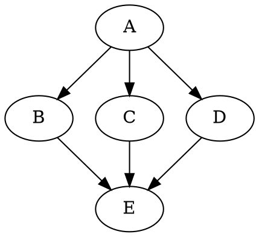
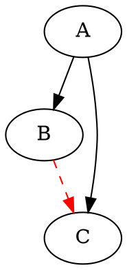
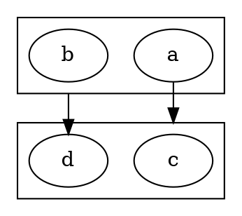
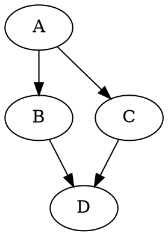
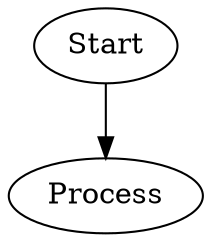
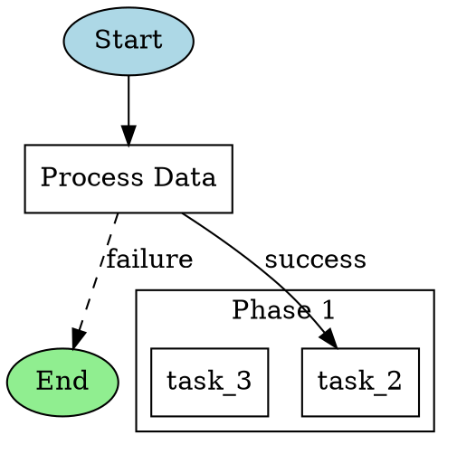

# DOT/Graphviz Ecosystem Research

> Comprehensive research for designing an Amplifier bundle that leverages the DOT/Graphviz ecosystem.
> Research conducted: 2026-03-13

---

## Table of Contents

1. [DOT Language Specification](#1-dot-language-specification)
2. [Graphviz Layout Engines](#2-graphviz-layout-engines)
3. [DOT Rendering & Output Formats](#3-dot-rendering--output-formats)
4. [Python Libraries for DOT](#4-python-libraries-for-dot)
5. [DOT Validation](#5-dot-validation)
6. [DOT in AI/LLM Contexts](#6-dot-in-aillm-contexts)
7. [DOT Alternatives & Comparison](#7-dot-alternatives--comparison)
8. [Advanced DOT Features](#8-advanced-dot-features)
9. [DOT Ecosystem Tools](#9-dot-ecosystem-tools)
10. [Recommendations for Amplifier Bundle Design](#10-recommendations-for-amplifier-bundle-design)

---

## 1. DOT Language Specification

**Source:** [graphviz.org/doc/info/lang.html](https://graphviz.org/doc/info/lang.html)

### Overview

DOT is a graph description language developed as part of the Graphviz project. Files use `.gv` (preferred) or `.dot` extension. The MIME type is `text/vnd.graphviz`. DOT is historically an acronym for "DAG of tomorrow."

### Abstract Grammar

```
graph       : [ 'strict' ] ('graph' | 'digraph') [ ID ] '{' stmt_list '}'
stmt_list   : [ stmt [ ';' ] stmt_list ]
stmt        : node_stmt | edge_stmt | attr_stmt | ID '=' ID | subgraph
attr_stmt   : ('graph' | 'node' | 'edge') attr_list
attr_list   : '[' [ a_list ] ']' [ attr_list ]
a_list      : ID '=' ID [ (';' | ',') ] [ a_list ]
edge_stmt   : (node_id | subgraph) edgeRHS [ attr_list ]
edgeRHS     : edgeop (node_id | subgraph) [ edgeRHS ]
node_stmt   : node_id [ attr_list ]
node_id     : ID [ port ]
port         : ':' ID [ ':' compass_pt ] | ':' compass_pt
subgraph    : [ 'subgraph' [ ID ] ] '{' stmt_list '}'
compass_pt  : n | ne | e | se | s | sw | w | nw | c | _
```

### Core Language Features

| Feature | Description |
|---------|-------------|
| **Graph types** | `graph` (undirected, uses `--`) and `digraph` (directed, uses `->`) |
| **Strict mode** | `strict graph`/`strict digraph` — forbids multi-edges |
| **Subgraphs** | Named or anonymous groupings of nodes/edges |
| **Clusters** | Subgraphs with names starting with `cluster` — rendered as bounding rectangles |
| **Attributes** | Key-value pairs on nodes, edges, graphs, subgraphs in `[key=value]` syntax |
| **Default attributes** | Set via `node [attr=val]`, `edge [attr=val]`, `graph [attr=val]` |
| **Ports** | Compass points on nodes for edge attachment: `n, ne, e, se, s, sw, w, nw, c, _` |
| **Comments** | C/C++ style: `/* */`, `//`, and `#` lines |
| **String concatenation** | Double-quoted strings support `+` concatenation |
| **HTML labels** | Labels delimited by `<...>` instead of `"..."` — support HTML-like table markup |
| **Edge shorthand** | `A -> {B C}` equivalent to `A -> B; A -> C` |

### ID Types

1. **Alphabetic strings** — `[a-zA-Z\200-\377_][a-zA-Z\200-\377_0-9]*`
2. **Numerals** — `[-]?(.[0-9]+ | [0-9]+(.[0-9]*)? )`
3. **Double-quoted strings** — `"..."` with escaped quotes `\"`
4. **HTML strings** — `<...>` with matched angle brackets, legal XML content

### Character Encoding

- Default: **UTF-8**
- Also supports: **Latin1 (ISO-8859-1)** via `charset` attribute
- HTML entities supported for special characters (e.g., `&beta;`, `&amp;`)

### Keywords (case-insensitive)

`node`, `edge`, `graph`, `digraph`, `subgraph`, `strict`

---

## 2. Graphviz Layout Engines

**Source:** [graphviz.org man pages](https://graphviz.org/documentation/)

Graphviz provides **10 layout engines**, each optimized for different graph topologies:

### Primary Layout Engines

| Engine | Purpose | Best For | Algorithm |
|--------|---------|----------|-----------|
| **dot** | Hierarchical/layered layouts for directed graphs | DAGs, flowcharts, dependency trees, org charts | Sugiyama-style layered drawing; minimizes edge crossings |
| **neato** | Spring model for undirected graphs | Small-to-medium undirected graphs (<100 nodes), network topology | Kamada-Kawai spring model |
| **fdp** | Force-directed placement | Undirected graphs, clusters | Fruchterman-Reingold force model with grid-based multiscale approach |
| **sfdp** | Scalable force-directed | **Large graphs** (1000+ nodes), networks | Multilevel approach for scalability; handles massive graphs |
| **twopi** | Radial layouts | Hierarchies with a natural root, org structures | Places root at center, nodes in concentric circles by distance |
| **circo** | Circular layouts | Cyclic structures, ring topologies, finite state machines | Nodes placed on a circle, minimizes edge crossings |
| **osage** | Array-based layouts | Clustered graphs, tree maps, grid arrangements | Recursive array packing of cluster components |
| **patchwork** | Squarified tree maps | Hierarchical data visualization by area | Tree map algorithm with squarified rectangles |

### Utility Layout Engines

| Engine | Purpose |
|--------|---------|
| **nop** | No layout — reads and writes DOT with no positioning changes |
| **nop2** | Adjusts existing layout positions for routing/spacing |

### Engine Selection Guide

```
Is it a DAG / hierarchy?          → dot (default, best for most workflow use cases)
Is it undirected, < 100 nodes?    → neato
Is it undirected, > 100 nodes?    → fdp
Is it very large (1000+)?         → sfdp
Does it have a radial structure?  → twopi
Is it cyclic / ring topology?     → circo
Need a treemap?                   → patchwork
Need cluster-based grid layout?   → osage
```

### Key Insight for Bundle Design

**`dot` is the right engine for workflow/pipeline graphs** — it produces hierarchical top-to-bottom or left-to-right layouts that naturally represent sequential and parallel execution flows. The `rankdir` attribute controls direction: `TB` (top-bottom, default), `BT`, `LR`, `RL`.

---

## 3. DOT Rendering & Output Formats

**Source:** [graphviz.org/docs/outputs/](https://graphviz.org/docs/outputs/)

Graphviz supports **35+ output formats**. The most relevant for a bundle are:

### Primary Formats

| Format | CLI Flag | Description | Pros | Cons |
|--------|----------|-------------|------|------|
| **SVG** | `-Tsvg`, `-Tsvgz`, `-Tsvg_inline` | Scalable Vector Graphics | Lossless, scalable, embeddable in HTML, supports CSS/JS, interactive tooltips & hyperlinks | Requires renderer for display |
| **PNG** | `-Tpng` | Raster image | Universal display support, good for embedding | Fixed resolution, no interactivity |
| **PDF** | `-Tpdf` | Portable Document Format | Print-quality, scalable vector | Not interactive, heavier weight |
| **JSON** | `-Tjson`, `-Tjson0`, `-Tdot_json`, `-Txdot_json` | Structured data | **Machine-readable**, round-trippable, includes layout positions | Not human-viewable directly |
| **DOT** | `-Tcanon`, `-Tdot`, `-Tgv`, `-Txdot` | Annotated DOT source | Round-trippable, includes layout info (bb, pos attributes) | Still text, not visual |
| **Plain Text** | `-Tplain`, `-Tplain-ext` | Simple line-based format | Easy to parse programmatically | Limited information |
| **PS/EPS** | `-Tps`, `-Teps` | PostScript | High-quality print, supports layers | Legacy format |

### JSON Output Variants (Important for Programmatic Use)

| Variant | Description |
|---------|-------------|
| `json` | Full graph structure with layout data in JSON |
| `json0` | JSON without layout/rendering attributes |
| `dot_json` | JSON representation of DOT structure |
| `xdot_json` | JSON with xdot drawing instructions |

### Additional Formats

ASCII art (`-Tascii`), BMP, GIF, JPEG, TIFF, WebP, WBMP, ICO, GD/GD2, PSD, SGI, TGA, EXR, JPEG 2000, PIC, PICT, POV-Ray, TK, VML, VRML, VT100 terminal, X11 window, GTK, Kitty terminal graphics, CGImage, FIG (Xfig), imagemaps (imap, cmapx)

### Recommendation for Bundle

- **SVG** — Best for visual rendering (scalable, interactive, web-friendly)
- **JSON** — Best for programmatic processing and validation
- **PNG** — Best for simple embedding in docs/chat
- **DOT (canon/xdot)** — Best for round-tripping with layout info preserved

---

## 4. Python Libraries for DOT

### Comparison Matrix

| Feature | **graphviz** (Python) | **pydot** | **pygraphviz** | **networkx** |
|---------|----------------------|-----------|----------------|-------------|
| **PyPI Package** | `graphviz` | `pydot` | `pygraphviz` | `networkx` |
| **Pure Python** | Yes | Yes | **No** (C extension via SWIG) | Yes |
| **Dependencies** | None (besides Graphviz binary) | `pyparsing` | Graphviz C library + headers | Optional: pydot or pygraphviz |
| **Can parse DOT files** | No | **Yes** (via pyparsing) | **Yes** (via C library) | Via pydot/pygraphviz bridge |
| **Can generate DOT** | **Yes** | **Yes** | **Yes** | Via export adapters |
| **Can render to image** | **Yes** (calls Graphviz CLI) | **Yes** (calls Graphviz CLI) | **Yes** (calls C library) | Via bridge |
| **Graph algorithms** | No | No | Limited | **Extensive** (shortest path, cycles, etc.) |
| **API style** | Builder pattern (`.node()`, `.edge()`) | Object model (Graph, Node, Edge) | dict-like (AGraph) | Full graph data structure |
| **Installation ease** | `pip install graphviz` | `pip install pydot` | Complex (needs C libs) | `pip install networkx` |
| **Maintenance** | Active (v0.21, 2024) | Active (v3.0.4, 2025) | Active (v1.14, 2024) | Very active (v3.6.1, 2025) |
| **Downloads/month** | ~10M | ~14M | ~2M | ~40M |
| **Jupyter support** | Built-in | No | No | Via matplotlib |

### Detailed Library Profiles

#### `graphviz` (Python package)
**Best for: Generating DOT and rendering from Python code**

```python
import graphviz

dot = graphviz.Digraph('workflow', format='svg')
dot.attr(rankdir='LR')
dot.node('A', 'Start', shape='ellipse')
dot.node('B', 'Process', shape='box')
dot.edge('A', 'B', label='begin')
dot.render('output', view=True)
print(dot.source)  # Get DOT source string
```

- Pure Python, simple API, excellent docs
- Cannot parse existing DOT files — generation only
- Built-in Jupyter notebook rendering (`_repr_svg_()`)
- Supports `graphviz.Source()` for rendering existing DOT strings
- Thread-safe rendering

#### `pydot` (Python package)
**Best for: Parsing and manipulating existing DOT files**

```python
import pydot

# Parse existing DOT
graphs = pydot.graph_from_dot_file('workflow.dot')
graph = graphs[0]

# Manipulate
graph.add_node(pydot.Node('new_node', label='New'))
graph.add_edge(pydot.Edge('A', 'new_node'))

# Render
graph.write_svg('output.svg')

# Generate DOT string
print(graph.to_string())
```

- **Can read/write/parse DOT files** — key differentiator
- Uses `pyparsing` for DOT grammar parsing
- Full object model: Graph, Subgraph, Cluster, Node, Edge
- Compatible with NetworkX (`networkx.drawing.nx_pydot`)
- Pure Python — easy install everywhere

#### `pygraphviz` (Python package)
**Best for: Direct C library access for performance-critical graph operations**

```python
import pygraphviz as pgv

G = pgv.AGraph(directed=True)
G.add_node('A', label='Start')
G.add_edge('A', 'B')
G.layout(prog='dot')
G.draw('output.svg')
```

- Wraps Graphviz C library directly via SWIG
- Fastest rendering (no subprocess overhead)
- Full access to all Graphviz features
- **Hard to install** — requires Graphviz C headers and development libraries
- Not recommended for environments without C build tools

#### `networkx` (Python package)
**Best for: Graph analysis algorithms with DOT import/export**

```python
import networkx as nx
from networkx.drawing.nx_pydot import read_dot, write_dot

# Read DOT into NetworkX graph
G = read_dot('workflow.dot')

# Analyze
cycles = list(nx.simple_cycles(G))
is_dag = nx.is_directed_acyclic_graph(G)
topo_order = list(nx.topological_sort(G))

# Export back to DOT
write_dot(G, 'output.dot')
```

- 500+ graph algorithms (cycles, paths, connectivity, etc.)
- Uses pydot or pygraphviz as DOT bridge
- Not a DOT library per se — a graph analysis library with DOT I/O

### Other Notable Libraries

| Library | Description |
|---------|-------------|
| **`diagrams`** | Python library for creating cloud architecture diagrams (uses Graphviz under the hood) |
| **`nxviz`** | Visualization library built on NetworkX |
| **`schemdraw`** | Circuit/schematic diagrams |
| **`dot2tex`** | Converts DOT to LaTeX (PGF/TikZ, PSTricks) |

### Recommendation for Bundle

Use a **layered approach**:
1. **`graphviz` (Python)** — Primary: generate DOT source and render visualizations
2. **`pydot`** — Secondary: parse existing DOT files, manipulate graph structure
3. **`networkx`** — Tertiary: graph analysis (cycle detection, topological sort, validation)

All three are pure Python (except networkx's optional deps) and pip-installable.

---

## 5. DOT Validation

### Current State of DOT Validation

**There is no dedicated DOT linter or standalone validator tool.** Validation is achieved through a combination of approaches:

### Validation Approaches

#### Level 1: Syntactic Validation (Does it parse?)

| Method | Tool | Description |
|--------|------|-------------|
| **Graphviz itself** | `dot -Tcanon input.dot > /dev/null` | Returns non-zero exit code on parse errors |
| **pydot parsing** | `pydot.graph_from_dot_data(source)` | Raises exceptions on malformed DOT |
| **graphviz.Source** | `graphviz.Source(source).render()` | Validates during render |

#### Level 2: Structural Validation (Is it well-formed?)

| Check | Tool | Description |
|-------|------|-------------|
| **Is it a DAG?** | `networkx.is_directed_acyclic_graph(G)` | Detects cycles |
| **Cycle detection** | `networkx.simple_cycles(G)` | Lists all cycles |
| **Connected components** | `networkx.weakly_connected_components(G)` | Finds disconnected subgraphs |
| **Topological sort** | `networkx.topological_sort(G)` | Verifies valid execution order |
| **Node reachability** | `networkx.has_path(G, source, target)` | Checks if end is reachable from start |
| **Isolated nodes** | `networkx.isolates(G)` | Finds unconnected nodes |

#### Level 3: Semantic Validation (Does it make sense for our domain?)

This is where custom validation adds the most value. For a workflow/pipeline context:

| Check | Implementation | Description |
|-------|---------------|-------------|
| **Single entry point** | Custom: count nodes with in-degree 0 | Workflow should have one start |
| **Single exit point** | Custom: count nodes with out-degree 0 | Workflow should converge to end |
| **Required attributes** | Custom: check node/edge attributes | e.g., all nodes must have `label` |
| **Valid attribute values** | Custom: validate against schema | e.g., `shape` must be from allowed set |
| **No self-loops** | `networkx.selfloop_edges(G)` | Nodes shouldn't point to themselves |
| **Cluster validity** | Custom: check subgraph naming | Clusters should start with `cluster_` |

#### Level 4: Graphviz Command-line Utilities

Graphviz ships with several analysis utilities:

| Tool | Purpose |
|------|---------|
| **`acyclic`** | Tests if graph is acyclic, can make it acyclic |
| **`gc`** | Graph connectivity: counts nodes, edges, connected components |
| **`ccomps`** | Decomposes into connected components |
| **`sccmap`** | Strongly connected component analysis |
| **`tred`** | Transitive reduction — removes redundant edges |
| **`bcomps`** | Biconnected component analysis |
| **`dijkstra`** | Shortest path computation |
| **`unflatten`** | Adjusts graph for better aspect ratio in `dot` layout |
| **`nop`** | Validates DOT by attempting to parse |

### Key Insight for Bundle Design

**Custom domain-specific validation is the biggest opportunity.** No existing tool validates DOT files for workflow semantics. A bundle skill that validates:
- Proper DAG structure (no cycles)
- Required start/end nodes
- Custom attribute schemas (e.g., required `label`, valid `shape`)
- Edge connectivity (all nodes reachable)
- Cluster naming conventions

...would be genuinely novel and valuable.

---

## 6. DOT in AI/LLM Contexts

### Existing Projects Using DOT for AI/Agent Workflows

#### 1. The Edge Agent (TEA) — DOT Workflow Orchestration
**Source:** [fabceolin.github.io/the_edge_agent](https://fabceolin.github.io/the_edge_agent/articles/dot-workflow-orchestration.html)

The most comprehensive existing implementation. Key features:
- DOT files define multi-agent pipeline dependencies
- Automatic topological sort for execution ordering
- Intelligent parallel execution (25-70% time reduction)
- tmux-based real-time monitoring
- Two modes: Command Mode (embedded shell commands) and Workflow Mode (template-based)
- Graphviz `cluster` subgraphs for phase grouping

Why they chose DOT:
> "DOT (Graphviz) provides: Ubiquitous standard format supported by hundreds of tools, Visual rendering for documentation and review, Declarative — describes 'what' not 'how', Version-controllable plain text."

#### 2. Microsoft Agent Framework — Workflow Visualization
**Source:** [learn.microsoft.com](https://learn.microsoft.com/en-us/agent-framework/workflows/visualization)

Microsoft's Semantic Kernel / Agent Framework uses DOT for visualization:
- `ToDotString()` method on Workflow class generates DOT format
- Used alongside Mermaid (`ToMermaidString()`)
- Workflows visualized as directed graphs for verification

#### 3. gpt-workflow — LLM-Generated Workflows
**Source:** [github.com/mrseanryan/gpt-workflow](https://github.com/mrseanryan/gpt-workflow)

Rationale for using DOT:
> "The DOT graph format is a simple way to represent a flow chart. A flow chart is a good approximation of a workflow. Because DOT graphs are a common public format, large LLMs such as OpenAI gpt-3.5-turbo have included them in their training corpus."

Key insight: **LLMs already know DOT syntax** because it's well-represented in training data.

#### 4. LangGraph — Graph-Based Agent Framework
**Source:** [langchain.com/langgraph](https://www.langchain.com/langgraph)

LangGraph models agent workflows as directed graphs:
- Nodes are functions or LLM calls
- Edges define transitions
- Typed state flows through the pipeline
- Supports loops, branching, and dynamic transitions
- Can export workflow visualizations (though uses its own internal representation)

#### 5. Knowledge Graph Generation
Multiple projects use DOT/Graphviz for visualizing LLM-generated knowledge graphs:
- llama-cpp-agent framework for knowledge graph creation
- Various RAG pipelines use DOT for ontology visualization

### Key Insight for Bundle Design

DOT is a **natural fit for LLM-generated workflows** because:
1. LLMs have strong DOT in their training data
2. DOT syntax is simple and unambiguous
3. It's declarative — describes structure, not rendering details
4. It's machine-parseable and machine-generatable
5. Multiple existing projects validate this approach

---

## 7. DOT Alternatives & Comparison

### Text-to-Diagram Language Comparison

| Feature | **DOT/Graphviz** | **Mermaid** | **PlantUML** | **D2** |
|---------|-----------------|-------------|-------------|--------|
| **First released** | 1991 | 2014 | 2009 | 2022 |
| **Language** | C | JavaScript | Java | Go |
| **License** | EPL-1.0 | MIT | GPL-3.0 | MPL-2.0 |
| **Syntax complexity** | Low-medium | Low | Medium | Low |
| **Layout engines** | 10 (dot, neato, fdp, etc.) | Built-in | Built-in | ELK, dagre |
| **GitHub rendering** | No | **Yes** (native) | No | No |
| **LLM familiarity** | **High** (in training since 1991) | High (popular in docs) | Medium | Low |
| **Directed graphs** | **Excellent** | Good | Good | Good |
| **Undirected graphs** | **Yes** | Limited | Limited | No |
| **Layout control** | **Extensive** (rank, constraint, etc.) | Limited | Limited | Moderate |
| **Custom shapes** | **60+** built-in | ~10 | 20+ | Limited |
| **HTML labels** | **Yes** (full table support) | No | No | Markdown |
| **Clusters/containers** | **Yes** | Subgraphs | Packages | **Yes** |
| **Edge routing** | **Splines, ortho, polyline** | Auto | Auto | Auto |
| **JSON output** | **Yes** | No | No | No |
| **Output formats** | **35+** | SVG, PNG | SVG, PNG, PDF, etc. | SVG, PNG, PDF |
| **Programmatic APIs** | Extensive (C, Python, JS, etc.) | JS API | Java API | Go API |
| **Interactive viewers** | Many | Live editor | Live editor | Playground |

### Why DOT Is Preferred for Machine-Generation by LLMs

1. **Training data prevalence**: DOT has been in use since 1991 — vastly more examples in LLM training corpora than newer alternatives.

2. **Syntactic simplicity**: A valid DOT graph is just:
   ```dot
   digraph { A -> B }
   ```
   This minimizes LLM hallucination errors.

3. **Unambiguous grammar**: DOT has a formal BNF grammar. LLMs generate syntactically valid DOT far more reliably than Mermaid (which has many implicit rules).

4. **Separation of concerns**: DOT describes *structure only* — layout is handled by engines. LLMs don't need to reason about positioning.

5. **Machine-parseable**: DOT has robust parsers (pydot's pyparsing, Graphviz's C parser, @hpcc-js/wasm). Mermaid parsing is less standardized.

6. **Round-trippable**: Generate DOT → parse → analyze → modify → render. This pipeline is well-supported.

7. **Rich attribute system**: Custom attributes can carry domain-specific metadata without breaking the format.

### When Alternatives Win

| Scenario | Better Choice | Why |
|----------|--------------|-----|
| GitHub README diagrams | **Mermaid** | Native GitHub rendering |
| UML sequence diagrams | **PlantUML** or **Mermaid** | Purpose-built for UML |
| Aesthetic diagrams | **D2** | Modern rendering engine |
| Simple flowcharts in docs | **Mermaid** | Lower learning curve |
| Architecture diagrams | **D2** or `diagrams` (Python) | Container/cloud icons |

### When DOT Wins

| Scenario | Why DOT |
|----------|---------|
| **Complex graph layouts** | 10 layout engines, extensive control |
| **Machine-generated graphs** | Formal grammar, robust parsing |
| **Graph analysis pipelines** | JSON output, NetworkX integration |
| **Large graphs (100+ nodes)** | sfdp engine handles thousands of nodes |
| **Custom shapes and labels** | 60+ shapes, HTML table labels |
| **Workflow orchestration** | DAG semantics, topological sort, parallel execution |
| **Round-trip processing** | Parse → analyze → modify → render pipeline |

---

## 8. Advanced DOT Features

### 8.1 Node Shapes

Graphviz provides **60+ built-in shapes** in three categories:

**Polygon-based** (most common):
```
box, ellipse, circle, diamond, triangle, pentagon, hexagon, octagon,
rectangle, square, star, cylinder, note, tab, folder, box3d, component,
parallelogram, trapezium, house, invtriangle, invtrapezium, invhouse,
doublecircle, doubleoctagon, tripleoctagon, point, plaintext, plain, none,
Mdiamond, Msquare, Mcircle, underline, septagon
```

**Record-based** (structured, largely superseded by HTML labels):
```
record    — rectangular subdivided box
Mrecord   — record with rounded corners
```

Record label syntax: `"<port> label | <port> label | { nested | fields }"`

**Synthetic biology shapes** (specialized):
```
promoter, cds, terminator, utr, primersite, restrictionsite,
fivepoverhang, threepoverhang, noverhang, assembly, signature,
insulator, ribosite, rnastab, proteasesite, proteinstab,
rpromoter, rarrow, larrow, lpromoter
```

### 8.2 HTML-Like Labels

HTML labels enable rich, table-based node content. Delimited by `<...>` instead of `"..."`.

**Supported HTML-like elements:**

| Element | Purpose |
|---------|---------|
| `<TABLE>` | Table container (BORDER, CELLBORDER, CELLSPACING, CELLPADDING, BGCOLOR, COLOR, STYLE, etc.) |
| `<TR>` | Table row |
| `<TD>` | Table cell (PORT, COLSPAN, ROWSPAN, ALIGN, VALIGN, BGCOLOR, BORDER, SIDES, WIDTH, HEIGHT, FIXEDSIZE, HREF, etc.) |
| `<FONT>` | Font control (COLOR, FACE, POINT-SIZE) |
| `<B>`, `<I>`, `<U>`, `<S>` | Bold, italic, underline, strikethrough |
| `<SUB>`, `<SUP>` | Subscript, superscript |
| `<BR/>` | Line break (ALIGN attribute for left/center/right) |
| `<HR/>` | Horizontal rule |
| `<VR/>` | Vertical rule |
| `` | Embedded image (SRC attribute) |

**Example:**

```dot
digraph {
  node [shape=plaintext]
  a [label=<
    <TABLE BORDER="0" CELLBORDER="1" CELLSPACING="0">
      <TR><TD PORT="f0" BGCOLOR="lightblue">input</TD></TR>
      <TR><TD PORT="f1">process</TD></TR>
      <TR><TD PORT="f2" BGCOLOR="lightgreen">output</TD></TR>
    </TABLE>>]
}
```


**PORT attribute on `<TD>`**: Allows edges to connect to specific cells within a table-shaped node — critical for detailed workflow diagrams.

### 8.3 Edge Routing & Splines

The `splines` graph attribute controls edge routing:

| Value | Effect |
|-------|--------|
| `splines=true` (default) | Spline curves avoiding nodes |
| `splines=false` | Straight line segments |
| `splines=ortho` | Orthogonal (right-angle) routing |
| `splines=polyline` | Polyline routing |
| `splines=curved` | Curved edges |
| `splines=line` | Straight lines (may overlap nodes) |
| `splines=""` | No edge routing |
| `splines=compound` | Enables edges between clusters (with `compound=true`) |

### 8.4 Rank Constraints

Control vertical/horizontal positioning in `dot` layout:

| Attribute | Applied To | Effect |
|-----------|-----------|--------|
| `rank=same` | Subgraph | All nodes on same rank (level) |
| `rank=min` | Subgraph | Nodes on minimum rank |
| `rank=max` | Subgraph | Nodes on maximum rank |
| `rank=source` | Subgraph | Nodes on minimum rank exclusively |
| `rank=sink` | Subgraph | Nodes on maximum rank exclusively |
| `rankdir=TB` | Graph | Top-to-bottom layout (default) |
| `rankdir=LR` | Graph | Left-to-right layout |
| `rankdir=BT` | Graph | Bottom-to-top layout |
| `rankdir=RL` | Graph | Right-to-left layout |
| `ranksep` | Graph | Spacing between ranks (inches) |
| `nodesep` | Graph | Spacing between nodes on same rank |
| `newrank=true` | Graph | Improved rank assignment algorithm |

**Example — forcing nodes to same level:**


### 8.5 Arrow Shapes

14 primitive arrow shapes combinable into 1,544,761 variations:

**Primitives:** `box`, `crow`, `curve`, `diamond`, `dot`, `inv`, `none`, `normal`, `tee`, `vee`, `icurve`, `lnormal`, `rnormal`

**Modifiers:** `o` (open/hollow), `l` (left half), `r` (right half)

**Applied via:** `arrowhead`, `arrowtail`, `dir` (both/forward/back/none)

### 8.6 Layers

Graphviz supports drawing **layers** (overlays) for selective rendering:



- Layer selection via `layerselect` attribute
- Multi-layer output primarily supported in PostScript
- Useful for showing different views of the same graph

### 8.7 Compound Edges (Edges Between Clusters)



### 8.8 Edge Constraint Control



### 8.9 Custom Attributes

DOT allows **arbitrary custom attributes** that Graphviz ignores but tools can use:



Custom attributes are preserved in DOT output and JSON output — this is extremely useful for embedding domain-specific metadata.

### 8.10 Graph-Level Attributes Summary

Over **180 attributes** are defined across nodes, edges, graphs, and clusters. Key categories:

| Category | Key Attributes |
|----------|---------------|
| **Layout** | `rankdir`, `ranksep`, `nodesep`, `rank`, `ordering`, `newrank`, `splines` |
| **Sizing** | `size`, `ratio`, `margin`, `pad`, `dpi`, `resolution` |
| **Color** | `color`, `bgcolor`, `fillcolor`, `fontcolor`, `pencolor`, `colorscheme` |
| **Font** | `fontname`, `fontsize`, `fontcolor` |
| **Shape** | `shape`, `width`, `height`, `fixedsize`, `regular`, `peripheries` |
| **Style** | `style` (filled, dashed, dotted, bold, rounded, invis, striped, wedged) |
| **Labels** | `label`, `xlabel`, `headlabel`, `taillabel`, `labeljust`, `labelloc` |
| **Edges** | `arrowhead`, `arrowtail`, `dir`, `constraint`, `weight`, `minlen`, `headport`, `tailport` |
| **Interaction** | `URL`, `href`, `tooltip`, `target`, `id`, `class` |
| **Clusters** | `label`, `style`, `color`, `bgcolor`, `penwidth` |
| **Overlap** | `overlap`, `sep`, `esep`, `overlap_scaling` |

---

## 9. DOT Ecosystem Tools

### 9.1 VS Code Extensions

| Extension | Features | Installs |
|-----------|----------|----------|
| **Graphviz Interactive Preview** (`tintinweb.graphviz-interactive-preview`) | Syntax highlighting, live preview, zoom/pan, search, edge tracing, SVG/DOT export | Most popular |
| **Graphviz (dot) language support** (`joaompinto.vscode-graphviz`) | Syntax highlighting, snippets | Syntax only |

### 9.2 Web-Based Renderers & Editors

| Tool | URL | Description |
|------|-----|-------------|
| **Graphviz Online** | [dreampuf.github.io/GraphvizOnline](https://dreampuf.github.io/GraphvizOnline/) | Real-time DOT editor with instant SVG rendering |
| **Graphviz Visual Editor** | [magjac.com/graphviz-visual-editor](https://magjac.com/graphviz-visual-editor/) | Interactive visual editing of DOT graphs |
| **WebGraphviz** | [webgraphviz.com](http://webgraphviz.com/) | Simple browser-based renderer |
| **Edotor** | [edotor.net](https://edotor.net/) | Modern DOT editor with multiple layout engines |
| **Graphviz Playground** | [graph.flyte.org](https://graph.flyte.org/) | Multi-format output (SVG, PNG, JSON, plain) |
| **QuickChart GraphViz API** | [quickchart.io](https://quickchart.io/documentation/graphviz-api/) | HTTP API for rendering DOT to images |

### 9.3 JavaScript/WASM Libraries

| Library | Description | Status |
|---------|-------------|--------|
| **@hpcc-js/wasm-graphviz** | WASM compilation of Graphviz — **recommended for browser use** | Active, fast, modern |
| **d3-graphviz** | D3.js integration with animated transitions between graph states | Active, feature-rich |
| **Viz.js** | Original JS port of Graphviz (predecessor to @hpcc-js/wasm) | Superseded |
| **vis.js** | Accepts DOT input for network graph rendering | Active |
| **Canviz** | Canvas-based DOT renderer | Legacy |

**@hpcc-js/wasm-graphviz** is the current best-in-class for browser rendering:
- Full Graphviz engine compiled to WebAssembly
- All layout engines available
- Local-first (no server needed)
- Fast rendering
- Used by d3-graphviz under the hood

### 9.4 Interactive Viewers

| Tool | Platform | Description |
|------|----------|-------------|
| **xdot** | Linux/macOS | Interactive DOT viewer with zooming |
| **Smyrna** | Cross-platform | 3D graph viewer (part of Graphviz) |
| **gvedit** | Cross-platform | Simple Graphviz GUI editor |
| **dotty/lefty** | X11 | Legacy interactive editors |
| **preview-dot** | Windows | Windows Explorer preview pane integration |
| **Delineate** | Linux (Rust) | Interactive DOT editor with live preview, export to PNG/SVG/JPEG |

### 9.5 Graphviz Command-Line Utilities

Beyond the layout engines, Graphviz ships with powerful utilities:

| Tool | Purpose |
|------|---------|
| **gvpr** | Graph pattern scanning and processing language (AWK for graphs) |
| **gvpack** | Combine multiple graph layouts into single output |
| **gvmap** | Create geographic-style map visualizations of graphs |
| **gvcolor** | Colorize graphs based on structure |
| **gvgen** | Generate various graph types (complete, cycle, star, etc.) |
| **edgepaint** | Color edges to improve readability |
| **mingle** | Edge bundling for cleaner visualizations |
| **gml2gv** / **graphml2gv** | Convert from GML/GraphML to DOT |
| **gv2gxl** / **gxl2gv** | Convert between DOT and GXL |
| **mm2gv** | Convert Matrix Market format to DOT |

### 9.6 API Services

| Service | Description |
|---------|-------------|
| **QuickChart GraphViz API** | HTTP POST DOT source, receive rendered image |
| **Kroki** | Unified API for multiple diagram formats including DOT |

---

## 10. Recommendations for Amplifier Bundle Design

### Architecture Recommendations

Based on this research, here are key design decisions for a DOT graph Amplifier bundle:

#### 1. Python Library Stack

```
Primary:   graphviz (Python)    — DOT generation and rendering
Secondary: pydot                — DOT parsing and manipulation
Tertiary:  networkx             — Graph analysis and validation
```

All pure Python, all pip-installable, all actively maintained.

#### 2. DOT Subset for Workflows

For LLM-generated workflow graphs, recommend a **constrained DOT subset**:



#### 3. Validation Strategy

Implement three-tier validation:

1. **Syntax**: Parse with pydot to verify valid DOT grammar
2. **Structure**: Use networkx for DAG verification, connectivity, reachability
3. **Semantics**: Custom rules for workflow validity (single entry/exit, required attributes, etc.)

#### 4. Output Strategy

- **SVG** for visual rendering (supports interactivity via tooltips/hyperlinks)
- **JSON** (`-Tjson`) for machine processing and round-tripping
- **PNG** for simple embedding
- **DOT** (canon) for human-readable source with layout annotations

#### 5. Why DOT Over Alternatives

For an Amplifier bundle specifically:

| Advantage | Details |
|-----------|---------|
| **LLM-native** | DOT is well-represented in LLM training data; generation is reliable |
| **Formal grammar** | Enables robust parsing and validation |
| **Custom attributes** | Embed workflow metadata without breaking the format |
| **Ecosystem depth** | 10 layout engines, 35+ output formats, mature tooling |
| **Analysis capability** | NetworkX integration enables graph algorithms |
| **Round-trippable** | Parse → analyze → modify → render pipeline |
| **Declarative** | Describes structure, not presentation — LLMs focus on "what" not "how" |

---

## Sources

1. DOT Language Specification: https://graphviz.org/doc/info/lang.html
2. Graphviz Output Formats: https://graphviz.org/docs/outputs/
3. Graphviz Node Shapes: https://graphviz.org/doc/info/shapes.html
4. Graphviz Attributes: https://graphviz.org/doc/info/attrs.html
5. DOT Wikipedia: https://en.wikipedia.org/wiki/DOT_(graph_description_language)
6. graphviz Python package: https://pypi.org/project/graphviz/
7. pydot: https://pypi.org/project/pydot/
8. pygraphviz: https://pygraphviz.github.io/
9. NetworkX: https://networkx.org/
10. TEA DOT Workflow Orchestration: https://fabceolin.github.io/the_edge_agent/articles/dot-workflow-orchestration.html
11. gpt-workflow: https://github.com/mrseanryan/gpt-workflow
12. Microsoft Agent Framework Visualization: https://learn.microsoft.com/en-us/agent-framework/workflows/visualization
13. Text-to-Diagram Comparison: https://text-to-diagram.com/
14. d3-graphviz: https://github.com/magjac/d3-graphviz
15. @hpcc-js/wasm: https://www.npmjs.com/package/@hpcc-js/wasm-graphviz
16. Graphviz External Resources: https://graphviz.org/resources/
17. VS Code Graphviz Interactive Preview: https://marketplace.visualstudio.com/items?itemName=tintinweb.graphviz-interactive-preview
18. Graphviz Visual Editor: https://magjac.com/graphviz-visual-editor/
19. Mermaid vs Graphviz: https://www.unidiagram.com/blog/mermaid-vs-graphviz-comparison

---

**Research Confidence Level:** High. All information comes from official documentation, maintained open-source repositories, and established sources. The DOT specification and Graphviz project are mature (30+ years) and stable. Python library information is current as of early 2025. The AI/LLM usage patterns are emerging but validated by multiple independent projects.

**Gaps:**
- No formal benchmark data comparing LLM DOT generation accuracy vs. Mermaid/PlantUML accuracy
- Limited data on DOT generation error rates across different LLM models
- pygraphviz install difficulty on various platforms needs case-by-case assessment
- No existing DOT schema/validation standard — this is a genuine gap the bundle could fill
