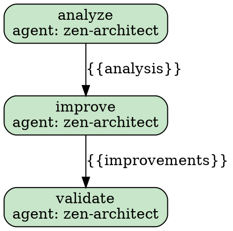
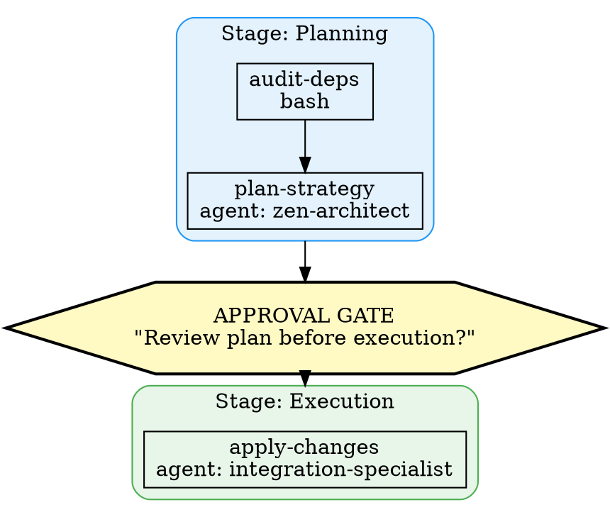

# Recipe-to-DOT Mapping Analysis

**How Amplifier recipes map to DOT digraphs, and why it matters**

*Analysis for `amplifier-bundle-dot-graph` — from the perspective of recipe-author*

---

## 1. The Case for DOT Visualization of Recipes

Recipes are declarative YAML workflows. They're readable, but as complexity grows — stages with approval gates, foreach loops with parallel execution, conditional branching, deeply nested sub-recipe invocations, while loops with convergence — the YAML becomes hard to hold in your head. You read it linearly, but the execution is a *graph*.

DOT is the natural representation. Recipes already *are* directed graphs:
- Steps are nodes
- Data flow (output → input) creates edges
- Stages are clusters
- Conditions create branches
- Loops create cycles
- Sub-recipes create hierarchical subgraphs

The insight: **recipe YAML is the serialization format; DOT is the comprehension format.**

---

## 2. Recipe Structure → DOT Mapping Specification

### 2.1 Core Mapping Table

| Recipe Element | DOT Construct | Shape | Color Semantics | Notes |
|---|---|---|---|---|
| **Recipe** (top-level) | `digraph` | — | — | One recipe = one digraph |
| **Step** (type: agent) | `node` | `box` (rounded) | Light green `#C8E6C9` | The workhorse; LLM invocation |
| **Step** (type: bash) | `node` | `box` | Light blue `#BBDEFB` | Deterministic shell execution |
| **Step** (type: recipe) | `node` | `box3d` (stacked) | Light orange `#FFE0B2` | Sub-recipe invocation; 3D box = "there's more inside" |
| **Stage** | `subgraph cluster_*` | — | Colored border per stage | Groups steps within a stage |
| **Approval gate** | `node` | `hexagon` | Yellow/amber `#FFF9C4` | Distinct shape = human intervention point |
| **Condition** | `node` | `diamond` | Light yellow `#FFF9C4` | Classic decision diamond from flowcharts |
| **foreach loop** | `subgraph cluster_*` | — | Light purple border `#CE93D8` | Cluster wrapping the iterated step(s) |
| **while loop** | Back-edge + `subgraph` | — | Purple border, dashed | Back-edge from end to condition check |
| **Data flow** (output→input) | `edge` (solid) | — | Dark gray | Default step-to-step flow |
| **Sub-recipe call** | `edge` (dashed) | — | Orange `#FF9800` | Cross-cluster edge with `lhead` |
| **Conditional edge** | `edge` with label | — | — | Label: `"true"` / `"false"` or condition text |
| **on_error: continue** | Edge annotation | — | — | Dashed edge to next step indicating non-fatal |
| **depends_on** | `edge` (dotted) | — | Blue | Explicit dependency, distinct from sequential flow |
| **Context variable** | (not shown by default) | — | — | Available as tooltip or annotation mode |
| **Final output step** | `node` | `box` (double border) | Darker green `#A5D6A7` | Last step or `final_output` producer |
| **Init/default step** | `node` | `box` | Light gray `#E0E0E0` | Setup/initialization steps |

### 2.2 Detailed Mapping Rules

#### 2.2.1 Flat Recipe (Sequential Steps)

The simplest case. Each step becomes a node. Edges connect them sequentially.



**Key rule:** Edge labels show the context variable that flows between steps (the `output` field of the source step).

#### 2.2.2 Staged Recipe (with Approval Gates)

Stages become `subgraph cluster_*` blocks. Approval gates become hexagon nodes *between* stage clusters.



**Key rules:**
- Approval gates live *between* stage clusters, not inside them.
- `required: true` gates use bold penwidth; `required: false` gates use thin/dashed.
- Gate label includes the approval `prompt` text (truncated).
- Timeout information shown as annotation: `timeout: 3600s, default: deny`.

#### 2.2.3 Conditional Execution

Steps with `condition` fields get a preceding diamond decision node. The diamond has two outgoing edges: one to the conditional step (labeled `true`), one bypassing it (labeled `false` or `skip`).

```dot
// For: condition: "{{severity}} == 'critical'"
cond_critical [label="severity\n== 'critical'?", shape=diamond, fillcolor="#FFF9C4"]
cond_critical -> critical_fix [label="true"]
cond_critical -> next_step [label="false", style=dashed]
```

**Optimization:** When multiple consecutive steps share the same condition target (e.g., a classification routing pattern), they can share a single diamond with multiple outgoing edges, creating a switch-like visual:

```dot
classify -> router
router [label="classification?", shape=diamond, fillcolor="#FFF9C4"]
router -> simple_process [label="'simple'"]
router -> medium_process [label="'medium'"]
router -> complex_process [label="'complex'"]
```

#### 2.2.4 foreach Loops

A foreach step becomes a cluster with an iteration indicator. The cluster border is purple/dashed to signal repetition.

```dot
subgraph cluster_foreach_analyze {
    label=<<B>foreach:</B> {{files}} <B>as:</B> current_file<BR/>
           <I>parallel: true | collect: file_analyses</I>>
    style="rounded,dashed"
    color="#CE93D8"
    bgcolor="#F3E5F5"

    analyze_each [label="analyze-each\nagent: zen-architect", fillcolor="#C8E6C9"]
}
```

**Key rules:**
- Cluster label shows: `foreach: <variable>`, `as: <loop_var>`, `parallel: true/false/N`, `collect: <var>`.
- If `parallel: true`, add a parallel indicator (e.g., `|||` icon or "parallel" annotation).
- If `parallel: N` (bounded), show the concurrency limit.
- The step inside the cluster is drawn once (not N times) — the cluster itself communicates iteration.

#### 2.2.5 while Loops (Convergence)

While loops use a back-edge from the loop body back to the condition check, creating a visible cycle. This is the classic "do-while" pattern in flowcharts.

```dot
while_cond [label="counter < max?\nwhile_condition", shape=diamond, fillcolor="#F3E5F5"]
loop_body [label="iterate\nbash: increment", fillcolor="#BBDEFB"]
break_check [label="break_when:\ndone == 'true'?", shape=diamond, fillcolor="#FFF9C4", style="filled,dashed"]

while_cond -> loop_body [label="true"]
loop_body -> break_check
break_check -> while_cond [label="continue", style=dashed, color="#CE93D8", constraint=false]
break_check -> next_step [label="break/done"]
while_cond -> next_step [label="false"]
```

**Key rules:**
- `while_condition` becomes a diamond at loop entry.
- `break_when` becomes a diamond at loop exit.
- Back-edge uses `constraint=false` to avoid distorting the layout.
- `max_while_iterations` shown as annotation on the back-edge or cluster label.
- `update_context` shown as annotations on the loop body node.
- `while_steps` (multi-step loop body) expands into a chain within the loop cluster.

#### 2.2.6 Recipe Composition (Sub-Recipes)

Sub-recipe invocations (`type: "recipe"`) are the most visually interesting. Two rendering modes:

**Collapsed mode** (default): Sub-recipe shown as a single `box3d` node (3D stacked box shape, suggesting depth):

```dot
security_audit [
    label=<<B>security-audit</B><BR/>
           <I>type: recipe</I><BR/>
           security-audit.yaml<BR/>
           context: target={{file_path}}>,
    shape=box3d,
    fillcolor="#FFE0B2"
]
```

**Expanded mode** (on request): Sub-recipe contents rendered as a nested `subgraph cluster_*` with dashed orange border, containing the sub-recipe's own steps:

```dot
subgraph cluster_sub_security_audit {
    label=<<B>security-audit.yaml</B> v1.0.0<BR/><I>(sub-recipe)</I>>
    style="rounded,dashed"
    color="#FF9800"
    penwidth=2
    bgcolor="#FFF3E0"

    sub_scan [label="scan\nagent: security-guardian", fillcolor="#C8E6C9"]
    sub_classify [label="classify\nagent: security-guardian", fillcolor="#C8E6C9"]
    sub_scan -> sub_classify
}
```

**Key rules:**
- Dashed edge from parent step to sub-recipe cluster with `lhead`.
- Context isolation shown by listing only the explicitly-passed context variables on the calling edge.
- Recursion depth annotated when `recursion.max_depth` is configured.
- For `foreach` + `type: "recipe"` (common pattern), the sub-recipe cluster goes *inside* the foreach cluster.

#### 2.2.7 Error Handling Annotations

Error handling configuration is shown as visual annotations rather than structural elements:

| Config | Visual Treatment |
|---|---|
| `on_error: "fail"` | Default — no annotation needed |
| `on_error: "continue"` | Dashed outgoing edge + small `⚠` icon on node |
| `on_error: "skip_remaining"` | Edge labeled `"skip rest on error"` |
| `retry` configured | Small retry icon `↻` with `max_attempts` count |
| `timeout` set | Italic annotation below node label |

#### 2.2.8 Provider/Model Selection

When steps specify `provider` or `model` (or `provider_preferences`), this is shown as a subtle annotation:

```dot
step [label=<<B>analyze</B><BR/>
       agent: zen-architect<BR/>
       <FONT POINT-SIZE="8" COLOR="#666666">provider: anthropic | model: claude-opus-*</FONT>>]
```

This is secondary information — visible but not dominating the visual hierarchy.

### 2.3 Recipe Metadata Rendering

The recipe's metadata becomes the graph title and subtitle:


Context variables (initial inputs) can optionally be shown as a "context box" — a record-shaped node at the top of the graph:

```dot
context [
    label="{Context Variables|file_path: (required)\lseverity_threshold: \"high\"\lauto_fix: false\l}",
    shape=record,
    fillcolor="#E8EAF6"
]
context -> first_step [style=dotted, label="initial context"]
```

---

## 3. Which Recipe Patterns Benefit MOST from DOT Visualization?

Ranked by visualization value (high to low):

### Tier 1: Massive Benefit

**1. Deeply Composed Recipes (recipe-calling-recipe)**
- **Why:** YAML nesting is *linear* — you read file A, then jump to file B, then back to A. DOT shows the *call tree* as a spatial hierarchy. You see the forest *and* the trees.
- **Example:** `comprehensive-review.yaml` calling `code-review-recipe.yaml` + `security-audit-recipe.yaml` — in DOT, the three-level structure is immediately apparent.
- **Value:** Turns a multi-file mental model into a single visual.

**2. Staged Recipes with Approval Gates**
- **Why:** Approval gates are *execution boundaries* — the most important structural feature of a staged recipe. In YAML, they're just another field buried in the stage definition. In DOT, they're prominent hexagonal nodes sitting between stage clusters, immediately communicating "human stops here."
- **Example:** `dependency-upgrade-staged-recipe.yaml` with 5 stages and 4 approval gates — the DOT shows the risk-ordered progression at a glance.
- **Value:** Makes human-in-loop checkpoints visually undeniable.

**3. Conditional Routing Patterns**
- **Why:** In YAML, conditional steps look like linear steps with a `condition` field. In DOT, the diamond routing nodes make the branching structure explicit — you see the decision tree, not a sequence.
- **Example:** `conditional-workflow.yaml` where classification routes to simple/medium/complex processing — the fan-out is visible.
- **Value:** Reveals branching logic that YAML hides.

### Tier 2: Strong Benefit

**4. Multi-Perspective Analysis (foreach + parallel)**
- **Why:** foreach with parallel execution creates a fan-out/fan-in pattern that's a single step in YAML but a rich visual structure in DOT.
- **Example:** `parallel-analysis-recipe.yaml` analyzing from security/performance/maintainability/testability perspectives simultaneously — DOT shows the parallelism and convergence.
- **Value:** Makes parallelism visible and the synthesis step's role clear.

**5. While Loops (Convergence Workflows)**
- **Why:** While loops with `update_context` and `break_when` create cycles. YAML can't show cycles — it's a list. DOT can, with back-edges.
- **Example:** Adversarial verification with iterative challenge/defense rounds — the DOT shows the loop structure, escalation tiers, and exit conditions.
- **Value:** Only format that correctly represents iterative convergence.

**6. Complex Flat Recipes (10+ steps)**
- **Why:** Even linear recipes benefit when they're long enough that you can't hold the full pipeline in working memory. DOT gives the overview.
- **Example:** `multi-level-python-code-analysis.yaml` with 15 steps across 4 phases — DOT with phase clustering makes it navigable.
- **Value:** Spatial layout aids comprehension of long pipelines.

### Tier 3: Moderate Benefit

**7. Simple Sequential Recipes (3-5 steps)**
- **Why:** These are already easy to understand in YAML. DOT adds visual polish but little comprehension value.
- **Value:** Nice for documentation; limited for understanding.

**8. Bash-Only Recipes**
- **Why:** Bash steps are deterministic — the "interesting" parts are the commands, not the flow. DOT shows the flow but not the commands.
- **Value:** Marginal unless combined with conditional logic or agent steps.

### Verdict

The **highest-value targets** for DOT visualization are:
1. Any recipe that spans multiple files (composition)
2. Any recipe with approval gates (staged)
3. Any recipe with branching logic (conditions)
4. Any recipe with loops (foreach, while)

The common thread: **DOT reveals structure that YAML encodes but doesn't show.**

---

## 4. How recipe-author Could USE DOT Representation

### 4.1 During Recipe Creation

When building a complex recipe through conversation, recipe-author could:

1. **Generate a DOT sketch early** — After understanding the workflow but before writing YAML, generate a DOT graph of the proposed structure. Show it to the user: "Here's what I'm thinking — does this flow look right?"

2. **Iterate on structure visually** — Let the user say "move the validation before the synthesis" or "add an approval gate between stages 2 and 3" and update the DOT before touching YAML.

3. **Validate structural soundness** — Before generating YAML, check the DOT graph for:
   - Unreachable nodes (steps that no path leads to)
   - Missing convergence (fan-out without fan-in)
   - Orphaned outputs (steps producing output no one consumes)
   - Missing approval gates (high-risk stages without human checkpoints)

### 4.2 For Recipe Validation

DOT enables structural analysis that's awkward with YAML:

```
STRUCTURAL CHECKS (from DOT graph):
✅ All nodes reachable from entry point
✅ No orphaned outputs (all outputs consumed by at least one downstream step)
⚠️  Step "optional-enhance" has on_error: continue but no downstream
    step checks whether it succeeded
❌ Cycle detected: step A → step B → step A (without while_condition)
⚠️  Stage "deployment" has no approval gate but modifies production
```

Specific validations DOT enables:

| Validation | What DOT Reveals |
|---|---|
| **Reachability analysis** | Are there steps no path leads to? (Dead code in recipes) |
| **Output consumption** | Does every `output` variable get referenced by a downstream step? |
| **Cycle detection** | Are there unintentional cycles from `depends_on`? |
| **Fan-in completeness** | Does a synthesis step actually depend on all the analyses it claims to combine? |
| **Approval gate coverage** | Are there high-risk stages (deployment, deletion) without approval gates? |
| **Condition exhaustiveness** | Do conditional branches cover all cases? Is there a "fall-through"? |
| **Context flow integrity** | Can every variable reference be resolved at runtime? (Trace paths through graph) |

### 4.3 For Recipe Explanation

When a user asks "explain this recipe," recipe-author could:

1. Generate DOT with full annotations (agent names, output variables, conditions)
2. Walk through the graph spatially: "Starting at the top, we enter the Planning stage..."
3. Highlight critical paths, approval gates, and error handling visually

### 4.4 For Recipe Comparison

When refining a recipe (v1 → v2), generate DOT for both and highlight diffs:
- New nodes in green
- Removed nodes in red (strikethrough)
- Changed edges in orange
- Structural changes immediately visible

### 4.5 For Recipe Composition Design

When helping users decide whether to extract sub-recipes, DOT reveals:
- Which clusters of steps form natural boundaries
- Where context isolation would be clean (few variables crossing the boundary)
- Whether a candidate sub-recipe has a clear single entry/exit point

---

## 5. Critique of the Existing Example: `bundle-validation-recipes.dot`

The example at `/home/bkrabach/dev/recipe-testing/bundle-validation-recipes.dot` visualizes three related recipes as a single DOT graph. Here's what it does well and what could be improved:

### 5.1 What It Does Well

**Excellent structural fidelity:**
- Three recipes correctly rendered as three `subgraph cluster_*` blocks
- Sub-recipe relationship between `validate-bundle.yaml` and `validate-single-bundle.yaml` shown with dashed orange edge and `lhead` — this is exactly right
- Phase sub-clusters within `validate-bundle-repo.yaml` correctly group related steps

**Strong color semantics:**
- Consistent color coding: blue for bash, green for agent, purple for foreach, yellow for conditions, gray for init/default
- The legend at bottom documents the color scheme — essential for any non-trivial graph

**Good use of DOT features:**
- `compound=true` enables cross-cluster edges (required for sub-recipe calls)
- HTML labels (`<<B>...</B>>`) provide rich formatting within nodes
- Phase sub-clusters create visual grouping without losing the step-level detail
- Conditional gates rendered as diamonds with true/false edge labels

**Information density is right:**
- Each node shows: step ID (bold), brief description, agent name (if agent step), timeout
- Not overloaded — you can scan the graph and understand the flow

### 5.2 What Could Be Improved

**1. The foreach step should be a cluster, not just a hexagon node**

Currently:
```dot
vb_foreach [label=<<B>validate-bundles</B><BR/>foreach: discovery.bundles<BR/>...>, shape=hexagon, fillcolor="#E1BEE7"]
```

The hexagon communicates "this is different" but doesn't show *what's inside* the loop. The iterated step (the sub-recipe call) should be *inside* a foreach cluster, with the hexagon as the cluster's header or entry node. This would better represent that the foreach wraps the sub-recipe invocation:

```dot
subgraph cluster_foreach_validate {
    label=<<B>foreach:</B> discovery.bundles<BR/><I>sequential | collect: bundle_results</I>>
    style="rounded,dashed"
    color="#CE93D8"
    bgcolor="#F3E5F5"

    vb_foreach_body [label="validate-single-bundle\ntype: recipe", shape=box3d, fillcolor="#FFE0B2"]
}
```

**2. Approval gates are absent despite staged recipe patterns**

The `validate-bundle-repo.yaml` has phases but no approval gates shown. If any of these phases *should* have approval gates (e.g., before applying fixes), the visualization should make their absence visible. Even "no approval gate" is information worth encoding — perhaps as a small "no gate" annotation between phases.

**3. The sub-recipe's expanded view could use `box3d` shape**

The edge from `vb_foreach` to `vs_trace` with `lhead=cluster_validate_single` correctly shows the sub-recipe call. But the *calling node* should use `shape=box3d` to visually signal "this invokes another recipe" even before you follow the edge.

**4. Phase 2 fan-out/fan-in could be more explicit**

In `validate-bundle-repo.yaml`, Phase 2 has a clear fan-out from `vr_val_all` to 5 parallel validation steps, then fan-in to `vr_quality`. This is a multi-perspective analysis pattern. The current rendering shows this correctly with edges, but adding `{rank=same; vr_hygiene; vr_standalone; vr_experiments; vr_context_sink; vr_tool_place}` would force the parallel steps to the same horizontal level, making the fan-out/fan-in pattern more visually striking.

**5. Edge labels for data flow are missing**

The edges between steps have no labels showing which context variable flows between them. Adding `label="{{discovery}}"` on the edge from `vb_discover → vb_foreach` would show the data flow, not just the control flow. This is valuable for understanding what information each step consumes.

**6. Error handling is invisible**

`vr_val_all` has `on_error: continue` — this is structurally important (it means downstream steps still run even if some validations fail) but it's only mentioned in the node label, not visually distinct. A dashed outgoing edge or a small `⚠` icon would make it scannable.

**7. The conditional routing in Phase 3 could be cleaner**

The `vr_llm_gate` diamond correctly shows the condition, but the two `true` edges to `vr_composition` and `vr_conventions` suggest they're alternatives, when they're actually both taken when `requires_llm_analysis` is true. This is a case where the DOT is slightly misleading — it looks like a choice but it's a fan-out. Consider using a single edge to a grouping node or `{rank=same}` hint.

### 5.3 Overall Assessment

**Grade: B+**

This is a strong first example. It demonstrates that complex multi-recipe structures *can* be effectively represented in DOT, and the core mapping decisions (clusters for recipes, diamonds for conditions, hexagons for foreach, color-coding by step type) are sound. The improvements are refinements, not fundamental redesign.

---

## 6. The Recipe-to-DOT Mapping Specification (Formal)

### 6.1 Graph Skeleton

```dot
// Every recipe-to-DOT conversion starts with this skeleton
digraph {{recipe.name}} {
    // Layout
    rankdir=TB
    compound=true          // Required for cross-cluster edges (sub-recipes)
    newrank=true           // Better ranking with clusters

    // Typography
    fontname="Helvetica"
    fontsize=14
    label=<<B>{{recipe.name}}</B> v{{recipe.version}}<BR/>
           <I>{{recipe.description}}</I>>
    labelloc=t

    // Global node defaults
    node [fontname="Helvetica", fontsize=10, style="filled,rounded", shape=box]
    edge [fontname="Helvetica", fontsize=9]

    // ... nodes and edges ...
}
```

### 6.2 Node Generation Rules

For each step in the recipe:

```python
def step_to_node(step):
    # Determine shape
    if step.type == "recipe":
        shape = "box3d"
    elif step.type == "bash":
        shape = "box"
    else:  # agent
        shape = "box"

    # Determine color
    if step == recipe.steps[-1] or step.output == "final_output":
        fillcolor = "#A5D6A7"  # final output: darker green
    elif step.type == "bash":
        fillcolor = "#BBDEFB"  # bash: light blue
    elif step.type == "recipe":
        fillcolor = "#FFE0B2"  # recipe: light orange
    elif step.type == "agent":
        fillcolor = "#C8E6C9"  # agent: light green
    else:
        fillcolor = "#E0E0E0"  # default: light gray

    # Build label
    label_parts = [f"<B>{step.id}</B>"]
    if step.agent:
        label_parts.append(f"{step.agent}")
    if step.mode:
        label_parts.append(f"mode: {step.mode}")
    if step.type == "recipe":
        label_parts.append(f"recipe: {step.recipe}")
    if step.type == "bash":
        label_parts.append("bash")
    if step.timeout:
        label_parts.append(f"<I>timeout: {step.timeout}s</I>")

    return f'{step.id} [label=<{"<BR/>".join(label_parts)}>, shape={shape}, fillcolor="{fillcolor}"]'
```

### 6.3 Edge Generation Rules

```python
def generate_edges(steps):
    edges = []
    for i, step in enumerate(steps):
        # Sequential flow
        if i < len(steps) - 1:
            next_step = steps[i + 1]
            label = f'{{{{step.output}}}}' if step.output else ""
            edges.append(f'{step.id} -> {next_step.id} [label="{label}"]')

        # Explicit dependencies
        if step.depends_on:
            for dep_id in step.depends_on:
                edges.append(f'{dep_id} -> {step.id} [style=dotted, color="#2196F3"]')

    return edges
```

### 6.4 Condition Node Insertion

When a step has a `condition` field, insert a diamond node *before* it:

```python
def insert_condition_node(step, previous_step, next_unconditional_step):
    cond_id = f"cond_{step.id}"
    cond_label = step.condition  # e.g., "{{severity}} == 'critical'"

    # Diamond node
    node = f'{cond_id} [label="{cond_label}", shape=diamond, fillcolor="#FFF9C4"]'

    # Edges: previous → diamond → step (true) and diamond → skip (false)
    true_edge = f'{cond_id} -> {step.id} [label="true"]'
    false_edge = f'{cond_id} -> {next_unconditional_step.id} [label="false", style=dashed]'

    return node, true_edge, false_edge
```

### 6.5 Stage Cluster Generation

For staged recipes, each stage becomes a cluster:

```python
def stage_to_cluster(stage, index):
    # Colors cycle through a palette
    palette = ["#2196F3", "#4CAF50", "#FF9800", "#9C27B0", "#F44336"]
    bg_palette = ["#E3F2FD", "#E8F5E9", "#FFF3E0", "#F3E5F5", "#FFEBEE"]

    cluster = f'''
    subgraph cluster_stage_{stage.name} {{
        label=<<B>Stage: {stage.name}</B>>
        style=rounded
        color="{palette[index % len(palette)]}"
        bgcolor="{bg_palette[index % len(bg_palette)]}"

        {render_steps(stage.steps)}
    }}
    '''

    # Approval gate (if present)
    if stage.approval and stage.approval.required:
        gate = f'''
        approval_{stage.name} [
            label=<APPROVAL GATE<BR/>
                   <I>{truncate(stage.approval.prompt, 60)}</I><BR/>
                   <FONT POINT-SIZE="8">timeout: {stage.approval.timeout}s | default: {stage.approval.default}</FONT>>,
            shape=hexagon,
            fillcolor="#FFF9C4",
            style=filled,
            penwidth=2
        ]
        '''
        return cluster, gate

    return cluster, None
```

### 6.6 Loop Cluster Generation

```python
def foreach_to_cluster(step):
    parallel_info = ""
    if step.parallel == True:
        parallel_info = "parallel: unbounded"
    elif isinstance(step.parallel, int):
        parallel_info = f"parallel: max {step.parallel}"
    else:
        parallel_info = "sequential"

    collect_info = f" | collect: {step.collect}" if step.collect else ""

    return f'''
    subgraph cluster_foreach_{step.id} {{
        label=<<B>foreach:</B> {step.foreach} <B>as:</B> {step.as_var}<BR/>
               <I>{parallel_info}{collect_info}</I>>
        style="rounded,dashed"
        color="#CE93D8"
        bgcolor="#F3E5F5"

        {render_step_node(step)}
    }}
    '''
```

### 6.7 Rendering Modes

The specification supports three rendering modes:

| Mode | When to Use | What's Shown |
|---|---|---|
| **Overview** | Quick structural understanding | Steps as nodes, flow edges, stage clusters. No annotations, collapsed sub-recipes. |
| **Detailed** | Deep understanding, documentation | Full annotations (agents, timeouts, variables), expanded sub-recipes, error handling icons, context flow labels on edges. |
| **Debug** | Troubleshooting execution issues | Everything in Detailed + context variable state at each node (from session checkpoint), highlighting of failed/skipped steps. |

---

## 7. The Vision: "Show Me This Recipe"

### 7.1 The Interaction

```
User: "Show me the adversarial-verification recipe"

recipe-author: [generates DOT for the 5-stage recipe]

  ┌─────────────────────────────┐
  │  adversarial-verification   │
  │  v2.2.0                     │
  └─────────────────────────────┘
              │
  ┌───────────┴───────────────┐
  │ Stage 1: Pre-Check        │
  │ ┌───────────────────────┐ │
  │ │ validate-inputs (bash)│ │
  │ └───────────────────────┘ │
  └───────────┬───────────────┘
              │
  ┌───────────┴───────────────┐
  │ Stage 2: Investigation    │
  │ ┌──────┐ ┌──────┐ ┌────┐ │
  │ │explor│ │ LSP  │ │arch│ │  ← parallel
  │ └──┬───┘ └──┬───┘ └──┬─┘ │
  └────┼────────┼────────┼────┘
       └────────┼────────┘
                │
  ┌─────────────┴─────────────┐
  │ Stage 3: Synthesis        │
  │ ┌───────────────────────┐ │
  │ │ combine-findings      │ │
  │ └───────────────────────┘ │
  └─────────────┬─────────────┘
                │
  ┌─────────────┴─────────────┐
  │ Stage 4: Verification     │
  │  ┌─────────────────────┐  │
  │  │ foreach: verifiers  │  │
  │  │ ┌─────┐ ┌─────┐    │  │
  │  │ │LSP  │ │Logic│ ←1.5x │
  │  │ ├─────┤ ├─────┤    │  │
  │  │ │Flow │ │Compl│    │  │
  │  │ └──┬──┘ └──┬──┘    │  │
  │  │    └───┬───┘       │  │
  │  │   ◇ converged?     │  │
  │  │   ↻ back to top    │  │  ← while loop back-edge
  │  └─────────────────────┘  │
  └─────────────┬─────────────┘
                │
          ⬡ APPROVAL GATE
          "Review verified document"
                │
  ┌─────────────┴─────────────┐
  │ Stage 5: Final Review     │
  │ ┌───────────────────────┐ │
  │ │ write-final-doc       │ │
  │ └───────────────────────┘ │
  └───────────────────────────┘
```

### 7.2 The Power of Nested Expansion

For composed recipes, the user could say:

```
User: "Show me comprehensive-review.yaml, expanded"

recipe-author: [generates DOT with sub-recipes expanded]

  digraph comprehensive_review {
      // Parent recipe
      subgraph cluster_parent {
          label="comprehensive-review v1.0.0"

          // Sub-recipe 1 (expanded)
          subgraph cluster_code_review {
              label="code-review-recipe.yaml (sub-recipe)"
              style="rounded,dashed"
              color="#FF9800"

              analyze_structure -> identify_issues -> suggest_improvements -> validate_suggestions
          }

          // Sub-recipe 2 (expanded)
          subgraph cluster_security_audit {
              label="security-audit-recipe.yaml (sub-recipe)"
              style="rounded,dashed"
              color="#FF9800"

              vuln_scan -> config_review -> dep_audit -> synthesize_security
          }

          // Synthesis step (parent)
          synthesize [label="synthesize\nzen-architect", fillcolor="#A5D6A7"]
      }

      // Edges showing composition
      validate_suggestions -> synthesize [label="{{review_results}}"]
      synthesize_security -> synthesize [label="{{security_results}}"]
  }
```

This is **impossible** in YAML — you'd need to open three files and mentally merge them. DOT makes it one picture.

### 7.3 Integration with the Bundle

The `amplifier-bundle-dot-graph` would provide:

1. **A recipe-to-DOT converter tool** — Takes a recipe YAML path, outputs DOT
2. **Rendering modes** — Overview, detailed, debug
3. **Expansion control** — Collapse/expand sub-recipes
4. **Diff mode** — Compare two recipe versions
5. **Integration with recipe-author** — Auto-generate DOT during recipe creation and validation

The recipe-author agent would use this as a first-class capability:

```yaml
# In recipe-author's toolkit:
tools:
  - module: tool-dot-graph
    # Provides: recipe_to_dot(recipe_path, mode, expand_sub_recipes)
    # Provides: validate_dot_structure(dot_string)
    # Provides: render_dot(dot_string, format)  # svg, png, ascii
```

### 7.4 Bidirectional: DOT → Recipe

The ultimate vision includes the reverse direction: a user sketches a DOT graph (or modifies a generated one), and recipe-author converts it back to recipe YAML. This enables:

- **Visual recipe design** — Draw the graph, generate the YAML
- **Visual refactoring** — Rearrange nodes in DOT, regenerate YAML
- **Structural diffs** — Compare DOT graphs, apply structural changes to YAML

This is ambitious but architecturally sound — DOT and recipe YAML are both declarative, and the mapping is well-defined enough to be invertible for the subset of DOT we generate.

---

## 8. Summary: The Mapping at a Glance

```
RECIPE YAML                          DOT CONSTRUCT
──────────────────────────────────── ────────────────────────────────
recipe (top-level)              →    digraph
  name + version                →      graph label
  context variables             →      record node (optional)

stages (staged mode)            →    subgraph cluster_stage_*
  approval gate                 →      hexagon node between clusters
  steps within stage            →      nodes inside cluster

steps (flat mode)               →    sequential nodes + edges

step (type: agent)              →    box node, green fill
step (type: bash)               →    box node, blue fill
step (type: recipe, collapsed)  →    box3d node, orange fill
step (type: recipe, expanded)   →    subgraph cluster, dashed orange border

condition                       →    diamond node + true/false edges
foreach                         →    subgraph cluster, purple dashed border
  parallel: true                →      parallel indicator in cluster label
while_condition                 →    diamond + back-edge (cycle)
  break_when                    →      exit diamond node
  update_context                →      annotation on loop body

depends_on                      →    dotted blue edge
output → next step's {{var}}    →    solid edge with variable label
on_error: continue              →    dashed edge + ⚠ icon
retry                           →    ↻ icon with count
timeout                         →    italic annotation

Legend                           →    subgraph cluster_legend
```

---

## 9. Next Steps for `amplifier-bundle-dot-graph`

1. **Formalize the mapping spec** as a machine-readable schema (JSON/YAML) that a converter tool can consume
2. **Build the recipe-to-DOT converter** — Parse recipe YAML, apply mapping rules, output DOT
3. **Add rendering support** — SVG generation via Graphviz, ASCII fallback for terminal
4. **Integrate with recipe-author** — Make DOT generation a standard part of recipe authoring, validation, and explanation
5. **Build the examples gallery** — Convert all example recipes to DOT, creating a visual catalog
6. **Explore DOT-to-recipe** — Investigate the reverse mapping for visual recipe design
7. **Add session overlay** — Show execution state (completed/running/pending/failed) on the DOT graph from session checkpoints

---

*This analysis was produced by recipe-author based on deep knowledge of the Amplifier recipe schema (v1.7.0), all documented design patterns, the complete examples catalog, and examination of the existing `bundle-validation-recipes.dot` example.*
